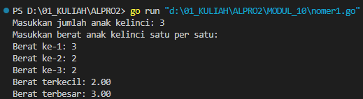
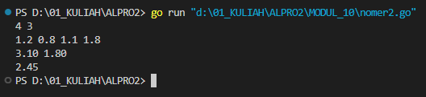
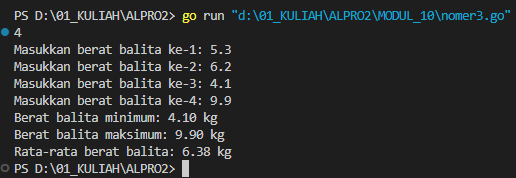

# <h1 align="center">Laporan Praktikum Modul 10 <br>  PENCARIAN NILAI EKSTRIM PADA HIMPUNAN DATA</h1>
<p align="center">INAYAH NAJMI ZAKIA - 103112430013</p>

## Dasar Teori
Pencarian nilai ekstrim berarti mencari **nilai minimum dan maksimum** dari suatu kumpulan data. Dalam pemrograman, ini merupakan proses dasar yang umum digunakan dalam analisis data, statistik, dan pemrosesan informasi.

Dalam bahasa golang, pencarian nilai ekstrim dilakukan dengan cara:
1. **Membaca dan menyimpan data** ke dalam array atau slice.
2. **Menginisialisasi nilai awal minimum dan maksimum** dari elemen pertama dalam data.
3. **Melakukan iterasi (looping)** untuk membandingkan setiap elemen dengan nilai minimum dan maksimum saat ini.
4. **Memperbarui nilai minimum atau maksimum** jika ditemukan nilai yang lebih kecil atau lebih besar.
# Unguided
___
# SOAL LATIHAN MODUL 10
### No. 1
Sebuah program digunakan untuk mendata berat anak kelinci yang akan dijual ke pasar. Program ini menggunakan array dengan kapasitas 1000 untuk menampung data berat anak kelinci yang akan dijual. 

Masukan terdiri dari sekumpulan bilangan, yang mana bilangan pertama adalah bilangan bulat N yang menyatakan banyaknya anak kelinci yang akan ditimbang beratnya. Selanjutnya N bilangan riil berikutnya adalah berat dari anak kelinci yang akan dijual. 
Keluaran terdiri dari dua buah bilangan riil yang menyatakan berat kelinci terkecil dan terbesar

```go
package main
import (
    "fmt"
)

func main() {
    var N int
    var berat [1000]float64
    fmt.Print("Masukkan jumlah anak kelinci: ")
    fmt.Scan(&N)
    if N <= 0 || N > 1000 {
        fmt.Println("Jumlah anak kelinci harus antara 1 sampai 1000.")
        return
    }

    fmt.Println("Masukkan berat anak kelinci satu per satu:")
    for i := 0; i < N; i++ {
        fmt.Printf("Berat ke-%d: ", i+1)
        fmt.Scan(&berat[i])
    }

    beratTerkecil := berat[0]
    beratTerbesar := berat[0]
    for i := 1; i < N; i++ {
        if berat[i] < beratTerkecil {
            beratTerkecil = berat[i]
        }
        if berat[i] > beratTerbesar {
            beratTerbesar = berat[i]
        }
    }

    fmt.Printf("Berat terkecil: %.2f\n", beratTerkecil)
    fmt.Printf("Berat terbesar: %.2f\n", beratTerbesar)

}}

```

> Output
> 


Program ini bertujuan untuk mendata berat anak kelinci dan mencari nilai berat terkecil dan terbesar dari data tersebut. Pertama, pengguna diminta memasukkan jumlah anak kelinci (`N`) yang akan ditimbang. Nilai ini divalidasi agar tidak kurang dari 1 dan tidak lebih dari 1000 karena array `berat` hanya menampung maksimal 1000 data. Kemudian, program meminta pengguna menginput berat setiap anak kelinci satu per satu dan menyimpannya ke dalam array. Setelah semua data dimasukkan, program menginisialisasi dua variabel yaitu `beratTerkecil` dan `beratTerbesar` dengan nilai dari elemen pertama array. Proses pencarian nilai ekstrim dilakukan dengan cara membandingkan setiap elemen dalam array. Jika ditemukan nilai yang lebih kecil dari `beratTerkecil`, maka nilainya diperbarui. Begitu juga jika ditemukan nilai lebih besar dari `beratTerbesar`. Setelah iterasi selesai, program mencetak hasil berat terkecil dan terbesar dengan format dua angka di belakang koma.

### No. 2
Sebuah program digunakan untuk menentukan tarif ikan yang akan dijual ke pasar. Program ini menggunakan array dengan kapasitas 1000 untuk menampung data berat ikan yang akan dijual. 

Masukan terdiri dari dua baris, yang mana baris pertama terdiri dari dua bilangan bulat x dan y. Bilangan x menyatakan banyaknya ikan yang akan dijual, sedangkan y adalah banyaknya ikan yang akan dimasukan ke dalam wadah. Baris kedua terdiri dari sejumlah x bilangan riil yang menyatakan banyaknya ikan yang akan dijual. 
Keluaran terdiri dari dua baris. Baris pertama adalah kumpulan bilangan riil yang menyatakan total berat ikan di setiap wadah (jumlah wadah tergantung pada nilai x dan y, urutan ikan yang dimasukan ke dalam wadah sesuai urutan pada masukan baris ke-2). Baris kedua adalah sebuah bilangan riil yang menyatakan berat rata-rata ikan di setiap wadah.

```go
package main
import (
    "fmt"
)

func main() {
    var x, y int
    var ikan [1000]float64
    fmt.Scan(&x, &y)
    for i := 0; i < x; i++ {
        fmt.Scan(&ikan[i])
    }

    jumlahWadah := (x + y - 1) / y
    total := make([]float64, jumlahWadah)
    for i := 0; i < x; i++ {
        total[i/y] += ikan[i]
    }
    
    for i := 0; i < jumlahWadah; i++ {
        fmt.Printf("%.2f ", total[i])
    }
    
    fmt.Println()
    var sum float64
    for _, t := range total {
        sum += t
    }

    fmt.Printf("%.2f\n", sum/float64(jumlahWadah))
}
}
```

> Output
> 


Program ini bertujuan untuk menghitung total berat ikan dalam beberapa wadah serta rata-rata berat per wadah. Pertama, pengguna memasukkan dua bilangan bulat yaitu `x` (jumlah ikan) dan `y` (jumlah ikan per wadah). Kemudian, pengguna memasukkan `x` buah bilangan riil sebagai berat ikan yang disimpan dalam array `ikan`. Jumlah wadah dihitung dengan rumus `(x + y - 1) / y` agar jika jumlah ikan tidak habis dibagi, tetap dibuat wadah tambahan. Setelah itu, program menjumlahkan berat ikan ke dalam wadah secara berurutan menggunakan `total[i/y] += ikan[i]`. Hasil total berat setiap wadah dicetak dalam satu baris. Selanjutnya, program menghitung jumlah seluruh berat dari semua wadah, lalu membaginya dengan jumlah wadah untuk mendapatkan rata-rata berat per wadah, dan mencetak hasilnya dengan dua angka di belakang koma.

### No. 3
Pos Pelayanan Terpadu (posyandu) sebagai tempat pelayanan kesehatan perlu mencatat data berat balita (dalam kg). Petugas akan memasukkan data tersebut ke dalam array. Dari data yang diperoleh akan dicari berat balita terkecil, terbesar, dan reratanya.

```go
package main
import (
    "fmt"
)

func hitungMinMax(arrBalita []float64) (float64, float64) {
    min := arrBalita[0]
    max := arrBalita[0]
    for _, v := range arrBalita {
        if v < min {
            min = v
        }
        if v > max {
            max = v
        }
    }
    return min, max
}

func rataRata(arrBalita []float64) float64 {
    var total float64
    for _, v := range arrBalita {
        total += v
    }
    return total / float64(len(arrBalita))
}

func main() {
    var n int
    var berat [100]float64
    fmt.Print("Masukkan banyak data balita: ")
    fmt.Scan(&n)
    for i := 0; i < n; i++ {
        fmt.Printf("Masukkan berat balita ke-%d: ", i+1)
        fmt.Scan(&berat[i])
    }

    data := berat[:n]
    min, max := hitungMinMax(data)
    rata := rataRata(data)
    fmt.Printf("Berat balita minimum: %.2f kg\n", min)
    fmt.Printf("Berat balita maksimum: %.2f kg\n", max)
    fmt.Printf("Rata-rata berat balita: %.2f kg\n", rata)
}

}
```

> Output
> 

Program ini digunakan untuk mengolah data berat badan balita, dengan tujuan menghitung berat minimum, maksimum, dan rata-rata. Pertama, program meminta input jumlah balita (`n`), kemudian membaca berat masing-masing balita ke dalam array `berat` dengan kapasitas 100. Setelah itu, data berat diambil sebanyak `n` elemen menggunakan slicing (`data := berat[:n]`) dan dikirim ke dua fungsi. Fungsi `hitungMinMax` akan mencari nilai minimum dan maksimum dengan membandingkan setiap elemen array menggunakan loop, sedangkan fungsi `rataRata` menjumlahkan semua berat dan membaginya dengan jumlah elemen untuk memperoleh rata-rata. Hasil dari ketiga perhitungan tersebut ditampilkan dalam satuan kilogram dengan dua angka di belakang koma.
