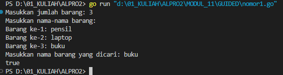
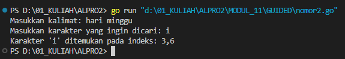
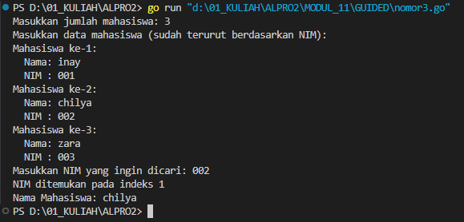
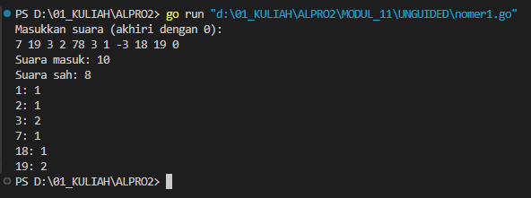
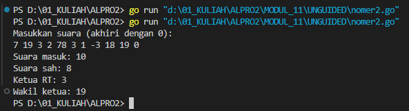
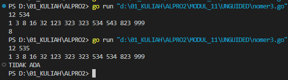

# <h1 align="center">Laporan Praktikum Modul 11 <br> PENCARIAN NILAI ACAK DALAM HIMPUNAN DATA</h1>
<p align="center">INAYAH NAJMI ZAKIA - 103112430013</p>

## Dasar Teori
Pencarian nilai acak dalam himpunan data merupakan proses untuk menemukan suatu nilai tertentu dalam kumpulan data yang tidak terurut. Linear search bekerja dengan memeriksa setiap elemen satu per satu dari awal hingga akhir hingga nilai yang dicari ditemukan atau seluruh data telah diperiksa. Metode ini cocok untuk data acak karena tidak memerlukan data dalam urutan tertentu, meskipun kurang efisien untuk dataset besar karena memiliki kompleksitas waktu O(n). Dalam Go, pencarian ini dapat diimplementasikan dengan mudah menggunakan slice dan perulangan `for` dengan fungsi sederhana yang mengembalikan indeks elemen jika ditemukan, atau -1 jika tidak.

# Guided
---
### No. 1
``` go
package main
import (
    "fmt"
    "strings"
)

func cariBarang(barang []string, x string) bool {
    for _, b := range barang {
        if strings.EqualFold(b, x) {
            return true
        }
    }
    return false
}

func main() {
    var n int
    fmt.Print("Masukkan jumlah barang: ")
    fmt.Scanln(&n)
    barang := make([]string, n)
    fmt.Println("Masukkan nama-nama barang:")
    for i := 0; i < n; i++ {
        fmt.Printf("Barang ke-%d: ", i+1)
        fmt.Scanln(&barang[i])
    }

    var x string
    fmt.Print("Masukkan nama barang yang dicari: ")
    fmt.Scanln(&x)
    fmt.Println(cariBarang(barang, x))
}
```
Output


Program ini digunakan untuk **mencari sebuah nama barang dalam daftar barang yang dimasukkan oleh pengguna**. Pengguna diminta untuk memasukkan jumlah barang, lalu nama-nama barang satu per satu. Setelah itu, pengguna diminta memasukkan nama barang yang ingin dicari. Fungsi `cariBarang` akan mengecek apakah nama barang yang dicari (`x`) ada dalam daftar barang dengan perbandingan **tidak peka huruf besar/kecil** (menggunakan `strings.EqualFold`). Jika ditemukan, fungsi mengembalikan `true`, jika tidak ditemukan, mengembalikan `false`.

**Singkatnya**: program ini membaca daftar barang, mencari satu nama barang, lalu mencetak `true` jika barang tersebut ditemukan, dan `false` jika tidak.

### No. 2
```go
package main
import (
    "bufio"
    "fmt"
    "os"
    "strings"
)

func printPositions(karakter string, posisi []int) {
    if len(posisi) > 0 {
        fmt.Printf("Karakter '%s' ditemukan pada indeks: %s\n", karakter, strings.Trim(strings.Join(strings.Fields(fmt.Sprint(posisi)), ","), "[]"))
    } else {
        fmt.Printf("Karakter '%s' tidak ditemukan dalam kalimat.\n", karakter)
    }
}

func main() {
    var karakter string
    reader := bufio.NewReader(os.Stdin)
    fmt.Print("Masukkan kalimat: ")
    kalimat, _ := reader.ReadString('\n')
    kalimat = strings.TrimSpace(kalimat)
    fmt.Print("Masukkan karakter yang ingin dicari: ")
    fmt.Scanln(&karakter)
    if len(karakter) != 1 {
        fmt.Println("Harap masukkan satu karakter saja.")
        return
    }
    
    var posisi []int
    for i, c := range kalimat {
        if string(c) == karakter {
            posisi = append(posisi, i)
        }
    }

    printPositions(karakter, posisi)
    
}
```
Output

Program Go di atas berfungsi untuk **mencari posisi indeks dari suatu karakter dalam sebuah kalimat** yang dimasukkan oleh pengguna. 
1. Pengguna diminta untuk memasukkan **sebuah kalimat** dan **satu karakter**.
2. Program kemudian **mengecek setiap karakter dalam kalimat**, dan jika karakter tersebut cocok dengan yang dicari, **menyimpan indeksnya**.
3. Hasil indeks-indeks tersebut dicetak oleh fungsi `printPositions`, atau jika tidak ditemukan, akan diberi pesan bahwa karakter tidak ada dalam kalimat.

### No. 3
```go
package main
import (
    "fmt"
)

type Mahasiswa struct {
    Nama string
    NIM  string
}

func binarySearch(mahasiswa []Mahasiswa, target string) int {
    low := 0
    high := len(mahasiswa) - 1
    for low <= high {
        mid := (low + high) / 2
        if mahasiswa[mid].NIM == target {
            return mid
        } else if mahasiswa[mid].NIM < target {
            low = mid + 1
        } else {
            high = mid - 1
        }
    }
    return -1
}

func main() {
    var n int
    fmt.Print("Masukkan jumlah mahasiswa: ")
    fmt.Scanln(&n)
    mahasiswa := make([]Mahasiswa, n)
    fmt.Println("Masukkan data mahasiswa (sudah terurut berdasarkan NIM):")

    for i := 0; i < n; i++ {
        fmt.Printf("Mahasiswa ke-%d:\n", i+1)
        fmt.Print("  Nama: ")
        fmt.Scanln(&mahasiswa[i].Nama)
        fmt.Print("  NIM : ")
        fmt.Scanln(&mahasiswa[i].NIM)
    }

    var cariNIM string
    fmt.Print("Masukkan NIM yang ingin dicari: ")
    fmt.Scanln(&cariNIM)
    indeks := binarySearch(mahasiswa, cariNIM)
    if indeks != -1 {
        fmt.Printf("NIM ditemukan pada indeks %d\n", indeks)
        fmt.Printf("Nama Mahasiswa: %s\n", mahasiswa[indeks].Nama)
    } else {
        fmt.Println("NIM tidak ditemukan.")
    }

}
```
Output

Program ini melakukan **pencarian data mahasiswa berdasarkan NIM menggunakan algoritma binary search**. Setiap mahasiswa memiliki dua atribut: `Nama` dan `NIM`, yang disimpan dalam struct `Mahasiswa`.
Penjelasan Alur Program:
1. **Input Data Mahasiswa:**
2. **Pencarian NIM:**
    - Pengguna diminta memasukkan NIM yang ingin dicari.
    - Fungsi `binarySearch()` digunakan untuk mencari posisi NIM tersebut dalam slice mahasiswa.
    - Jika ditemukan, program menampilkan **indeks** dan **nama mahasiswa** yang sesuai.
    - Jika tidak, menampilkan pesan "NIM tidak ditemukan."
3. Fungsi `binarySearch()`:
	- Mengimplementasikan binary search standar untuk mencari `target` NIM dalam slice `mahasiswa`.
	- Karena `NIM` adalah string, perbandingan dilakukan secara leksikografis (sesuai urutan abjad/angka string).

# Unguided
___
# SOAL LATIHAN MODUL 11
### No. 1
Minggu ini, mahasiswa Fakultas Informatika mendapatkan tugas dari mata kuliah matematika diskrit untuk mempelajari kombinasi dan permutasi. Jonas salah seorang mahasiswa, iseng untuk mengimplementasikannya ke dalam suatu program.

Masukan terdiri dari empat buah bilangan asli 𝑎, 𝑏, 𝑐, dan 𝑑 yang dipisahkan oleh spasi, dengan syarat 𝑎 ≥ 𝑐 dan 𝑏 ≥ 𝑑.
Keluaran terdiri dari dua baris. Baris pertama adalah hasil permutasi dan kombinasi 𝒂 terhadap 𝑐, sedangkan baris kedua adalah hasil permutasi dan kombinasi 𝑏 terhadap 𝑑.

Catatan: permutasi (P) dan kombinasi (C) dari 𝑛 terhadap 𝑟 (𝑛 ≥ 𝑟) dapat dihitung dengan menggunakan persamaan berikut!
𝑃(𝑛, 𝑟) = 𝑛!/(𝑛−𝑟)! , sedangkan 𝐶(𝑛, 𝑟) = 𝑛!/𝑟!(𝑛−𝑟)!


```go
package main
import "fmt"

func main() {
    var input int
    suaraMasuk := 0
    suaraSah := 0
    suara := [21]int{}
    fmt.Println("Masukkan suara (akhiri dengan 0):")
    for {
        fmt.Scan(&input)
        if input == 0 {
            break
        }

        suaraMasuk++  
        if input >= 1 && input <= 20 {
            suara[input]++
            suaraSah++
        }
    }

    fmt.Printf("Suara masuk: %d\n", suaraMasuk)
    fmt.Printf("Suara sah: %d\n", suaraSah)
    for i := 1; i <= 20; i++ {
        if suara[i] > 0 {
            fmt.Printf("%d: %d\n", i, suara[i])
        }
    }
}
```

> Output
> 

Program ini menghitung jumlah **suara masuk** dan **suara sah** (yang bernilai 1–20).  
Input suara dilakukan terus-menerus hingga pengguna memasukkan `0`.  
Suara sah disimpan dalam array, lalu ditampilkan jumlahnya per kandidat.
Contoh:  
Input `5 10 10 21 0` →
- Suara masuk: 4
- Suara sah: 3
- Output: `5: 1`, `10: 2` (karena 21 tidak sah).

### No. 2
Kompetisi pemrograman tingkat nasional berlangsung ketat. Setiap peserta diberikan 8 soal yang harus dapat diselesaikan dalam waktu 5 jam saja. Peserta yang berhasil menyelesaikan soal paling banyak dalam waktu paling singkat adalah pemenangnya. Buat program gema yang mencari pemenang dari daftar peserta yang diberikan. Program harus dibuat modular, yaitu dengan membuat prosedur hitungSkor yang mengembalikan total soal dan total skor yang dikerjakan oleh seorang peserta, melalui parameter formal. Pembacaan nama peserta dilakukan di program utama, sedangkan waktu pengerjaan dibaca di dalam prosedur.

prosedure hitungSkor(in/out soal, skor : integer)

Setiap baris masukan dimulai dengan satu string nama peserta tersebut diikuti dengan adalah 8 integer yang menyatakan berapa lama (dalam menit) peserta tersebut menyelesaikan soal. Jika tidak berhasil atau tidak mengirimkan jawaban maka otomatis dianggap menyelesaikan dalam waktu 5 jam 1 menit (301 menit). Satu baris keluaran berisi nama pemenang, jumlah soal yang diselesaikan, dan nilai yang diperoleh. Nilai adalah total waktu yang dibutuhkan untuk menyelesaikan soal yang berhasil diselesaikan.

Keterangan: Astuti menyelesaikan 6 soal dalam waktu 287 menit, sedangkan Bertha 7 soal dalam waktu 294 menit. Karena Bertha menyelesaikan lebih banyak, maka Bertha menang. Jika keduanya menyelesaikan sama banyak, maka pemenang adalah yang menyelesaikan dengan total waktu paling kecil.

```go
package main
import (
    "fmt"
    "math"
)
func hitungSkor(times [8]int) (int, int) {
    soal := 0
    totalWaktu := 0
    for _, t := range times {
        if t < 301 {
            soal++
            totalWaktu += t
        }
    }
    return soal, totalWaktu
}
func main() {
    var nama, pemenang string
    var times [8]int
    maxSoal := 0
    minWaktu := math.MaxInt32
    for {
        fmt.Print("Masukkan data peserta: ")
        _, err := fmt.Scan(&nama, &times[0], &times[1], &times[2], &times[3], &times[4], &times[5], &times[6], &times[7])
        if err != nil {
            break
        }
        if nama == "Selesai" {
            break
        }
        soal, totalWaktu := hitungSkor(times)
        if soal > maxSoal || (soal == maxSoal && totalWaktu < minWaktu) {
            pemenang = nama
            maxSoal = soal
            minWaktu = totalWaktu
        }
    }
    if pemenang != "" {
        fmt.Println(pemenang, maxSoal, minWaktu)
    } else {
        fmt.Println("Tidak ada peserta yang valid.")
    }
}
```

> Output
> 

Program ini mencari **pemenang lomba** berdasarkan jumlah soal yang diselesaikan (dengan waktu < 301 detik) dan total waktu tercepat.
1. Input: nama peserta + 8 waktu pengerjaan soal.
2. Jika nama = `"Selesai"`, input berhenti.
3. Fungsi `hitungSkor`:
    - Hitung jumlah soal dengan waktu < 301.
    - Jumlahkan total waktunya.
4. Program simpan peserta dengan soal terbanyak.
    - Jika soal sama, pilih yang total waktunya lebih sedikit.
5. Tampilkan pemenang, jumlah soal, dan total waktunya.

### No. 3
Skiena dan Revilla dalam Programming Challenges mendefinisikan sebuah deret bilangan. Deret dimulai dengan sebuah bilangan bulat n. Jika bilangan n saat itu genap, maka suku berikutnya adalah ½n, tetapi jika ganjil maka suku berikutnya bernilai 3n+1. Rumus yang sama digunakan terus menerus untuk mencari suku berikutnya. Deret berakhir ketika suku terakhir bernilai 1. 

Sebagai contoh jika dimulai dengan n=22, maka deret bilangan yang diperoleh adalah:
22 11 34 17 52 26 13 40 20 10 5 16 8 4 2 1

Untuk suku awal sampai dengan 1000000, diketahui deret selalu mencapai suku dengan nilai 1. Buat program skiena yang akan mencetak setiap suku dari deret yang dijelaskan di atas untuk nilai suku awal yang diberikan. Pencetakan deret harus dibuat dalam prosedur cetakDeret yang mempunyai 1 parameter formal, yaitu nilai dari suku awal.

prosedure cetakDeret(in n : integer )

Masukan berupa satu bilangan integer positif yang lebih kecil dari 1000000.
Keluaran terdiri dari satu baris saja. Setiap suku dari deret tersebut dicetak dalam baris yang dan dipisahkan oleh sebuah spasi.

```go
package main
import (
    "fmt"
)
func cetakDeret(n int) {
    for n != 1 {
        fmt.Print(n, " ")
        if n%2 == 0 {
            n /= 2
        } else {
            n = 3*n + 1
        }
    }
    fmt.Println(1)
}
func main() {
    var n int
    fmt.Scan(&n)
    if n > 0 && n < 1000000 {
        cetakDeret(n)
    } else {
        fmt.Println("Masukan harus bilangan positif kurang dari 1.000.000")
    }
}
```

> Output
> 

Program ini mencetak deret **Collatz** dari angka `n`. Deret ini memiliki aturan:
- Jika `n` **genap**, maka `n = n / 2`
- Jika `n` **ganjil**, maka `n = 3 * n + 1`
- Proses terus diulang sampai `n` menjadi 1

Input hanya diterima jika `n` adalah bilangan **positif** dan **kurang dari 1.000.000**. Jika tidak, akan muncul pesan error.
Contoh: Jika input `7`, maka program akan mencetak: `7 22 11 34 17 52 26 13 40 20 10 5 16 8 4 2 1`
