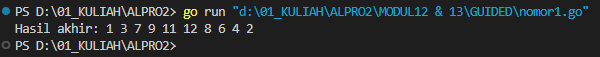
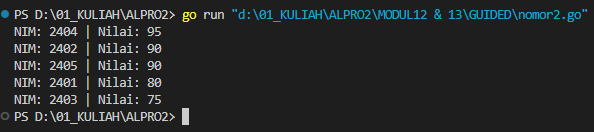
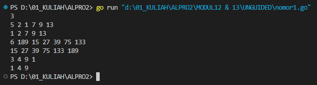
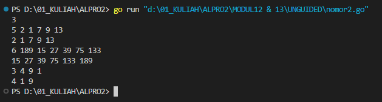
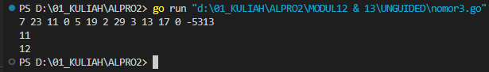
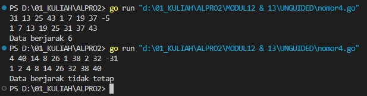
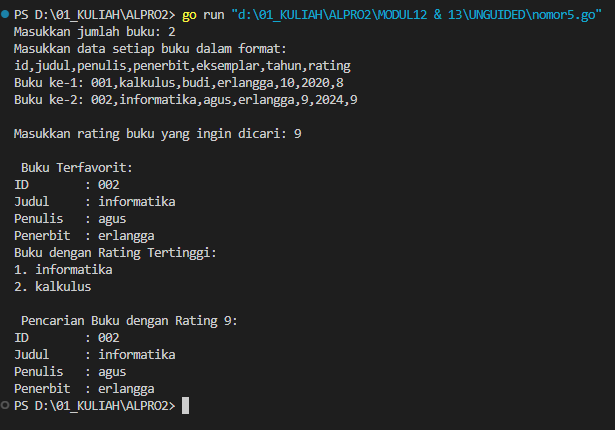

# <h1 align="center">Laporan Praktikum Modul 12 13 <br> PENGURUTAN DATA</h1>
<p align="center">INAYAH NAJMI ZAKIA - 103112430013</p>

## Dasar Teori
Dalam pemrograman, pengurutan (sorting) merupakan proses menyusun data berdasarkan urutan tertentu, baik secara menaik (ascending) maupun menurun (descending). Di dalam bahasa Go, pengurutan data dapat dilakukan menggunakan dua pendekatan, yaitu menggunakan algoritma manual seperti insertion sort, atau memanfaatkan package bawaan seperti sort.

# Guided
---
### No. 1
Diberikan `n` bilangan bulat positif. Buat program untuk mengurutkan angka ganjil secara membesar (ascending) dan angka genap secara mengecil (descending), lalu gabungkan hasilnya dengan ganjil duluan. Gunakan selection sort dalam proses pengurutan.
``` go
package main
import "fmt"

func selectionSortAscending(arr []int) {
    for i := 0; i < len(arr)-1; i++ {
        minIndex := i
        for j := i + 1; j < len(arr); j++ {
            if arr[j] < arr[minIndex] {
                minIndex = j
            }
        }
        arr[i], arr[minIndex] = arr[minIndex], arr[i]
    }
}

func selectionSortDescending(arr []int) {
    for i := 0; i < len(arr)-1; i++ {
        maxIndex := i
        for j := i + 1; j < len(arr); j++ {
            if arr[j] > arr[maxIndex] {
                maxIndex = j
            }
        }
        arr[i], arr[maxIndex] = arr[maxIndex], arr[i]
    }
}

func pisahGanjilGenap(data []int) ([]int, []int) {
    var ganjil, genap []int
    for _, nilai := range data {
        if nilai%2 == 1 {
            ganjil = append(ganjil, nilai)
        } else {
            genap = append(genap, nilai)
        }
    }
    return ganjil, genap
}

func printArray(arr []int) {
    for _, val := range arr {
        fmt.Print(val, " ")
    }
}

func main() {
    nilai := []int{12, 7, 3, 2, 9, 6, 8, 1, 11, 4}
    ganjil, genap := pisahGanjilGenap(nilai)
    selectionSortAscending(ganjil)
    selectionSortDescending(genap)
    fmt.Print("Hasil akhir: ")
    printArray(ganjil)
    printArray(genap)
    fmt.Println()
}
```
Output

Kode di atas merupakan implementasi program dalam bahasa Go yang memisahkan bilangan ganjil dan genap dari sebuah slice integer, kemudian mengurutkan bilangan ganjil secara menaik (ascending) dan bilangan genap secara menurun (descending) menggunakan algoritma selection sort. Fungsi `pisahGanjilGenap` bertugas membagi data ke dalam dua slice terpisah berdasarkan jenis bilangan, sedangkan dua fungsi `selectionSortAscending` dan `selectionSortDescending` digunakan untuk mengurutkan masing-masing slice. Setelah proses pengurutan selesai, hasil akhir berupa bilangan ganjil terurut naik diikuti bilangan genap terurut turun ditampilkan ke layar melalui fungsi `printArray`.

### No. 2
Sebuah kelas memiliki sejumlah siswa yang telah mengikuti ujian. Tugas Anda adalah membuat program yang membaca nilai-nilai ujian siswa dengan struct berisikan `nim` dan `nilai`, lalu mengurutkannya dari yang tertinggi ke yang terendah menggunakan insertion sort.
```go
package main
import "fmt"

type Siswa struct {
    NIM   string
    Nilai int
}

func insertionSortDescending(data []Siswa) {
    for i := 1; i < len(data); i++ {
        temp := data[i]
        j := i - 1
        for j >= 0 && data[j].Nilai < temp.Nilai {
            data[j+1] = data[j]
            j--
        }
        data[j+1] = temp
    }
}

func main() {
    siswa := []Siswa{
        {"2401", 80},
        {"2402", 90},
        {"2403", 75},
        {"2404", 95},
        {"2405", 90},
    }
    insertionSortDescending(siswa)
    for _, s := range siswa {
        fmt.Printf("NIM: %s | Nilai: %d\n", s.NIM, s.Nilai)
    }
}
```
Output

Program Go di atas berfungsi untuk mengurutkan data mahasiswa berdasarkan nilai (`Nilai`) secara menurun (descending) menggunakan algoritma _insertion sort_. Struct `Siswa` digunakan untuk menyimpan data mahasiswa yang terdiri dari NIM dan nilai. Fungsi `insertionSortDescending` melakukan pengurutan dengan membandingkan nilai satu per satu dari elemen kedua hingga akhir, lalu menyisipkan elemen tersebut ke posisi yang sesuai agar nilai-nilai lebih besar berada di depan. Setelah proses pengurutan selesai, fungsi `main` akan menampilkan daftar mahasiswa yang sudah diurutkan berdasarkan nilai tertinggi ke terendah. Program ini cocok digunakan untuk menampilkan peringkat atau urutan prestasi siswa.

# Unguided
___
# SOAL LATIHAN MODUL 12 13
### No. 1
Hercules, preman terkenal seantero ibukota, memiliki kerabat di banyak daerah. Tentunya Hercules sangat suka mengunjungi semua kerabatnya itu. Diberikan masukan nomor rumah dari semua kerabatnya di suatu daerah, buatlah program rumahkerabat yang akan menyusun nomor-nomor rumah kerabatnya secara terurut membesar menggunakan algoritma selection sort.
```go
package main
import (
    "fmt"
)

func selectionSort(arr []int) {
    n := len(arr)
    for i := 0; i < n-1; i++ {
        minIdx := i
        for j := i + 1; j < n; j++ {
            if arr[j] < arr[minIdx] {
                minIdx = j
            }
        }
        arr[i], arr[minIdx] = arr[minIdx], arr[i]
    }
}

func main() {
    var n int
    fmt.Scan(&n)
    for i := 0; i < n; i++ {
        var m int
        fmt.Scan(&m)
        rumah := make([]int, m)
        for j := 0; j < m; j++ {
            fmt.Scan(&rumah[j])
        }
        
        selectionSort(rumah)
        for _, val := range rumah {
            fmt.Print(val, " ")
        }
        fmt.Println()
    }
}
```

> Output
> 

Program Go di atas digunakan untuk membaca beberapa baris data, di mana setiap baris berisi sejumlah bilangan bulat yang mewakili nomor rumah, kemudian mengurutkan setiap baris tersebut menggunakan algoritma _selection sort_ dalam urutan menaik (_ascending_).

### No. 2
Belakangan diketahui ternyata Hercules itu tidak berani menyeberang jalan, maka selalu diusahakan agar hanya menyeberang jalan sesedikit mungkin, hanya diujung jalan. Karena nomor rumah sisi kiri jalan selalu ganjil dan sisi kanan jalan selalu genap, maka buatlah program kerabat dekat yang akan menampilkan nomor rumah mulai dari nomor yang ganjil lebih dulu terurut membesar dan kemudian menampilkan nomor rumah dengan nomor genap terurut mengecil.

```go
package main
import (
    "fmt"
)

func selectionSortDesc(arr []int) {
    n := len(arr)
    for i := 0; i < n-1; i++ {
        maxIdx := i
        for j := i + 1; j < n; j++ {
            if arr[j] > arr[maxIdx] {
                maxIdx = j
            }
        }
        arr[i], arr[maxIdx] = arr[maxIdx], arr[i]
    }
}
func selectionSortAsc(arr []int) {
    n := len(arr)
    for i := 0; i < n-1; i++ {
        minIdx := i
        for j := i + 1; j < n; j++ {
            if arr[j] < arr[minIdx] {
                minIdx = j
            }
        }
        arr[i], arr[minIdx] = arr[minIdx], arr[i]
    }
}
func main() {
    var n int
    fmt.Scan(&n)
    for i := 0; i < n; i++ {
        var m int
        fmt.Scan(&m)
        var genap []int
        var ganjil []int
        for j := 0; j < m; j++ {
            var nomor int
            fmt.Scan(&nomor)
            if nomor%2 == 0 {
                genap = append(genap, nomor)
            } else {
                ganjil = append(ganjil, nomor)
            }
        }
        selectionSortDesc(genap)
        selectionSortAsc(ganjil)
        for _, g := range genap {
            fmt.Printf("%d ", g)
        }
        for _, j := range ganjil {
            fmt.Printf("%d ", j)
        }
        fmt.Println()
    }
}
```

> Output
> 

Program Go di atas berfungsi untuk memisahkan bilangan genap dan ganjil dari beberapa baris input, lalu mengurutkannya secara berbeda: **bilangan genap diurutkan menurun (descending)**, sedangkan **bilangan ganjil diurutkan menaik (ascending)**, kemudian mencetak hasil gabungannya.

### No. 3
Kompetisi pemrograman yang baru saja berlalu diikuti oleh 17 tim dari berbagai perguruan tinggi ternama. Dalam kompetisi tersebut, setiap tim berlomba untuk menyelesaikan sebanyak mungkin problem yang diberikan. Dari 13 problem yang diberikan, ada satu problem yang menarik. Problem tersebut mudah dipahami, hampir semua tim mencoba untuk menyelesaikannya, tetapi hanya 3 tim yang berhasil. Apa sih problemnya? Buatlah program median yang mencetak nilai median terhadap seluruh data yang sudah terbaca, jika data yang dibaca saat itu adalah 0.

```go
package main
import (
    "bufio"
    "fmt"
    "os"
    "strconv"
)

func insertionSort(arr []int) {
    for i := 1; i < len(arr); i++ {
        key := arr[i]
        j := i - 1
        for j >= 0 && arr[j] > key {
            arr[j+1] = arr[j]
            j--
        }
        arr[j+1] = key
    }
}
func main() {
    scanner := bufio.NewScanner(os.Stdin)
    scanner.Split(bufio.ScanWords)
    var data []int
    for scanner.Scan() {
        valStr := scanner.Text()
        val, err := strconv.Atoi(valStr)
        if err != nil {
            fmt.Println("Input tidak valid")
            return
        }
  
        if val == -5313 {
            break
        } else if val == 0 {
            if len(data) == 0 {
                fmt.Println("Data kosong")
                continue
            }
            sorted := make([]int, len(data))
            copy(sorted, data)
            insertionSort(sorted)
            n := len(sorted)
            var median int
            if n%2 == 1 {
                median = sorted[n/2]
            } else {
                median = (sorted[n/2-1] + sorted[n/2]) / 2
            }
            fmt.Println(median)
        } else {
            data = append(data, val)
        }
    }
}
```

> Output
> 

Program ini mengurutkan data numerik yang dimasukkan secara bertahap. Input dibaca satu per satu menggunakan `bufio.Scanner`, dan akan berhenti jika pengguna memasukkan angka khusus `-5313`. Setiap kali pengguna memasukkan angka `0`, program akan menghitung dan mencetak **median** dari seluruh angka yang sudah dimasukkan sebelumnya. Jika jumlah data genap, median dihitung sebagai rata-rata dua nilai tengah; jika ganjil, median adalah nilai tengah setelah diurutkan. Program juga menangani kasus saat data masih kosong dengan mencetak pesan "Data kosong", dan menolak input yang bukan angka dengan memberikan pesan "Input tidak valid".

### No. 4
Buatlah sebuah program yang digunakan untuk membaca data integer seperti contoh yang diberikan di bawah ini, kemudian diurutkan (menggunakan metoda insertion sort), dan memeriksa apakah data yang terurut berjarak sama terhadap data sebelumnya.

```go
package main
import (
    "bufio"
    "fmt"
    "os"
    "strconv"
)

func insertionSort(arr []int) {
    for i := 1; i < len(arr); i++ {
        key := arr[i]
        j := i - 1
        for j >= 0 && arr[j] > key {
            arr[j+1] = arr[j]
            j--
        }
        arr[j+1] = key
    }
}
func isJarakTetap(arr []int) (bool, int) {
    if len(arr) < 2 {
        return true, 0
    }
    jarak := arr[1] - arr[0]
    for i := 2; i < len(arr); i++ {
        if arr[i]-arr[i-1] != jarak {
            return false, 0
        }
    }
    return true, jarak
}

func main() {
    scanner := bufio.NewScanner(os.Stdin)
    scanner.Split(bufio.ScanWords)
    var data []int
    for scanner.Scan() {
        input := scanner.Text()
        val, err := strconv.Atoi(input)
        if err != nil {
            fmt.Println("Input tidak valid")
            return
        }
        if val < 0 {
            break
        }
        data = append(data, val)
    }
    if len(data) == 0 {
        fmt.Println("Tidak ada data")
        return
    }
    insertionSort(data)
    for _, v := range data {
        fmt.Printf("%d ", v)
    }
    fmt.Println()
    tetap, jarak := isJarakTetap(data)
    if tetap {
        fmt.Printf("Data berjarak %d\n", jarak)
    } else {
        fmt.Println("Data berjarak tidak tetap")
    }
}
```

> Output
> 

Program ini membaca sejumlah bilangan bulat dari input, menyimpannya ke dalam slice, dan mengurutkannya menggunakan algoritma _insertion sort_. Input akan dihentikan saat pengguna memasukkan bilangan negatif. Setelah data diurutkan dan ditampilkan, program memeriksa apakah data tersebut memiliki **jarak tetap** antar elemen, yaitu selisih antara dua angka yang berurutan selalu sama. Jika data memenuhi syarat tersebut, program mencetak jarak tetapnya; jika tidak, akan ditampilkan pesan bahwa data tidak memiliki jarak tetap. Program juga menangani kondisi saat tidak ada data yang dimasukkan, dengan mencetak pesan “Tidak ada data”.

### No. 5
Sebuah program perpustakaan digunakan untuk mengelola data buku di dalam suatu perpustakaan.

```go
package main
import (
    "bufio"
    "fmt"
    "os"
    "strconv"
    "strings"
)
  
const nMax = 7919
type Buku struct {
    id        string
    judul     string
    penulis   string
    penerbit  string
    eksemplar int
    tahun     int
    rating    int
}
type DaftarBuku [nMax]Buku
func DaftarkanBuku(pustaka *DaftarBuku, n *int) {
    scanner := bufio.NewScanner(os.Stdin)
    fmt.Print("Masukkan jumlah buku: ")
    scanner.Scan()
    *n, _ = strconv.Atoi(scanner.Text())
    fmt.Println("Masukkan data setiap buku dalam format:")
    fmt.Println("id,judul,penulis,penerbit,eksemplar,tahun,rating")
    for i := 0; i < *n; i++ {
        fmt.Printf("Buku ke-%d: ", i+1)
        scanner.Scan()
        line := scanner.Text()
        data := strings.Split(line, ",")
        if len(data) < 7 {
            fmt.Println("Format salah. Coba lagi.")
            i--
            continue
        }
        eksemplar, _ := strconv.Atoi(data[4])
        tahun, _ := strconv.Atoi(data[5])
        rating, _ := strconv.Atoi(data[6])
        (*pustaka)[i] = Buku{
            id:        data[0],
            judul:     data[1],
            penulis:   data[2],
            penerbit:  data[3],
            eksemplar: eksemplar,
            tahun:     tahun,
            rating:    rating,
        }
    }
}
  
func CetakTerfavorit(pustaka DaftarBuku, n int) {
    if n == 0 {
        fmt.Println("Tidak ada buku.")
        return
    }
    max := pustaka[0]
    for i := 1; i < n; i++ {
        if pustaka[i].rating > max.rating {
            max = pustaka[i]
        }
    }
    fmt.Println("\n Buku Terfavorit:")
    cetakBuku(max)
}
  
func UrutBuku(pustaka *DaftarBuku, n int) {
    for i := 1; i < n; i++ {
        key := (*pustaka)[i]
        j := i - 1
        for j >= 0 && (*pustaka)[j].rating < key.rating {
            (*pustaka)[j+1] = (*pustaka)[j]
            j--
        }
        (*pustaka)[j+1] = key
    }
} 

func Cetak5Terbaru(pustaka DaftarBuku, n int) {
    fmt.Println("Buku dengan Rating Tertinggi:")
    limit := 5
    if n < 5 {
        limit = n
    }
    for i := 0; i < limit; i++ {
        fmt.Printf("%d. %s\n", i+1, pustaka[i].judul)
    }
}

func CariBuku(pustaka DaftarBuku, n int, r int) {
    fmt.Printf("\n Pencarian Buku dengan Rating %d:\n", r)
    low, high := 0, n-1
    for low <= high {
        mid := (low + high) / 2
        if pustaka[mid].rating == r {
            cetakBuku(pustaka[mid])
            return
        } else if pustaka[mid].rating < r {
            high = mid - 1
        } else {
            low = mid + 1
        }
    }
    fmt.Println(" Tidak ada buku dengan rating seperti itu.")
}

func cetakBuku(b Buku) {
    fmt.Printf("ID        : %s\n", b.id)
    fmt.Printf("Judul     : %s\n", b.judul)
    fmt.Printf("Penulis   : %s\n", b.penulis)
    fmt.Printf("Penerbit  : %s\n", b.penerbit)
}

func main() {
    var pustaka DaftarBuku
    var n int
    DaftarkanBuku(&pustaka, &n)
    scanner := bufio.NewScanner(os.Stdin)
    fmt.Print("\nMasukkan rating buku yang ingin dicari: ")
    scanner.Scan()
    ratingDicari, _ := strconv.Atoi(scanner.Text())
    CetakTerfavorit(pustaka, n)
    UrutBuku(&pustaka, n)
    Cetak5Terbaru(pustaka, n)
    CariBuku(pustaka, n, ratingDicari)
}
```

> Output
> 

Program ini merupakan aplikasi manajemen data buku yang dibuat menggunakan bahasa pemrograman Go. Fungsinya adalah untuk mendata sejumlah buku berdasarkan informasi seperti ID, judul, penulis, penerbit, jumlah eksemplar, tahun terbit, dan rating. Data buku dimasukkan melalui fungsi `DaftarkanBuku`, di mana pengguna diminta memasukkan jumlah buku yang akan diinput dan mengisi data setiap buku dalam format yang dipisahkan koma. Program kemudian menyimpan data tersebut dalam sebuah array bertipe `DaftarBuku`.
