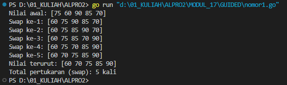
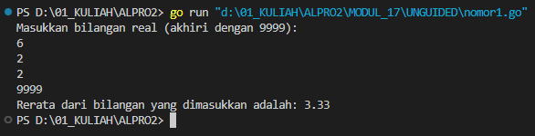
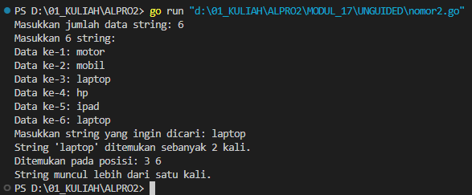
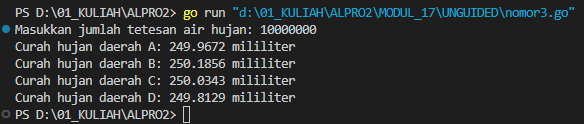
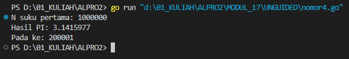
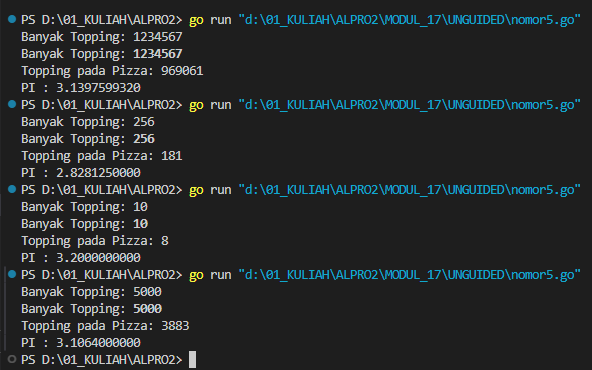

# <h1 align="center">Laporan Praktikum Modul 17 <br> SKEMA PEMROSESAN SEKUENSIAL</h1>
<p align="center">INAYAH NAJMI ZAKIA - 103112430013</p>

## Dasar Teori
Skema pemrosesan sekuensial dalam bahasa Go adalah alur eksekusi program yang berjalan secara berurutan, di mana setiap instruksi dijalankan satu per satu sesuai urutan penulisan dalam kode tanpa adanya percabangan, perulangan, atau paralelisme. Model ini merupakan dasar dari struktur program yang sederhana dan deterministik, sehingga hasil yang diperoleh akan selalu sama jika input tidak berubah. Dalam konteks Go, skema ini digunakan saat semua perintah dijalankan langsung di fungsi `main()` tanpa menggunakan fitur seperti goroutine atau channel. Contohnya adalah program yang mencetak teks langkah demi langkah atau menghitung nilai matematis seperti estimasi π secara linear, di mana setiap tahap proses dilakukan setelah tahap sebelumnya selesai.

# Guided
---
### No. 1
Aldi memiliki daftar nilai ulangan matematika temannya: 75, 60, 90, 85, dan 70. Ia ingin mengurutkan nilai tersebut dari yang terkecil ke yang terbesar menggunakan metode Bubble Sort. Pertanyaan:
1. Tunjukkan proses pengurutan nilai menggunakan Bubble Sort hingga semua nilai terurut.
2. Berapa kali pertukaran (swap) terjadi dalam proses ini?
``` go
package main
import (
    "fmt"
)

func main() {
    values := []int{75, 60, 90, 85, 70}
    swapCount := 0
    fmt.Println("Nilai awal:", values)
    n := len(values)
    for i := 0; i < n-1; i++ {
        for j := 0; j < n-i-1; j++ {
            if values[j] > values[j+1] {
                values[j], values[j+1] = values[j+1], values[j]
                swapCount++
                fmt.Printf("Swap ke-%d: %v\n", swapCount, values)
            }
        }
    }

    fmt.Println("Nilai terurut:", values)
    fmt.Printf("Total pertukaran (swap): %d kali\n", swapCount)
}
```
Output

Program di atas merupakan implementasi algoritma **Bubble Sort** dalam bahasa Go untuk mengurutkan slice `values` yang berisi angka-angka integer secara **menaik (ascending)**. Proses sorting dilakukan dengan membandingkan dua elemen berurutan dan menukarnya jika urutannya salah. Setiap kali terjadi pertukaran (swap), program mencetak kondisi array saat itu dan menghitung jumlah total pertukaran. Setelah proses selesai, program menampilkan array yang telah terurut beserta total pertukaran yang terjadi selama pengurutan.

# Unguided
___
# SOAL LATIHAN MODUL 17
### No. 1
Diberikan sejumlah bilangan real yang diakhiri dengan marker 9999, cari rerata dari bilanganbilangan tersebut.
```go
package main
import (
    "fmt"
)

func main() {
    var (
        input float64
        sum   float64
        count int
    )

    fmt.Println("Masukkan bilangan real (akhiri dengan 9999):")
    for {
        fmt.Scan(&input)
        if input == 9999 {
            break
        }
        sum += input
        count++
    }

    if count == 0 {
        fmt.Println("Tidak ada data yang dimasukkan.")
    } else {
        average := sum / float64(count)
        fmt.Printf("Rerata dari bilangan yang dimasukkan adalah: %.2f\n", average)
    }
}
```

> Output
> 

Program di atas adalah program **penghitung rata-rata bilangan real** dalam bahasa Go yang menerima input dari pengguna secara berulang hingga pengguna memasukkan angka **9999** sebagai tanda berhenti. Program akan menjumlahkan semua nilai yang dimasukkan (kecuali 9999) dan menghitung rata-ratanya dengan membagi total jumlah dengan banyaknya data yang dimasukkan. Jika tidak ada data yang dimasukkan sebelum 9999, program akan menampilkan pesan bahwa tidak ada data. Hasil akhirnya adalah nilai rata-rata yang ditampilkan dengan dua angka di belakang koma.

### No. 2
Diberikan string x dan n buah string. x adalah data pertama yang dibaca, n adalah data bilangan yang dibaca kedua, dan n data berikutnya adalah data string. Buat algoritma untuk menjawab pertanyaan berikut: 
a. Apakah string x ada dalam kumpulan n data string tersebut?
b. Pada posisi ke berapa string x tersebut ditemukan?
c. Ada berapakah string x dalam kumpulan n data string tersebut?
d. Adakah sedikitnya dua string x dalam n data string tersebut?

```go
package main
import "fmt"
func main() {
    var x string
    var n int
    fmt.Print("Masukkan jumlah data string: ")
    fmt.Scanln(&n)
    data := make([]string, n)
    fmt.Println("Masukkan", n, "string:")
    for i := 0; i < n; i++ {
        fmt.Printf("Data ke-%d: ", i+1)
        fmt.Scanln(&data[i])
    }

    fmt.Print("Masukkan string yang ingin dicari: ")
    fmt.Scanln(&x)  
    count := 0
    var positions []int
    for i := 0; i < n; i++ {
        if data[i] == x {
            count++
            positions = append(positions, i+1)
        }
    }

    if count == 0 {
        fmt.Println("String tidak ditemukan dalam kumpulan data.")
    } else {
        fmt.Printf("String '%s' ditemukan sebanyak %d kali.\n", x, count)
        fmt.Print("Ditemukan pada posisi: ")
        for _, pos := range positions {
            fmt.Printf("%d ", pos)
        }
        fmt.Println()
        if count >= 2 {
            fmt.Println("String muncul lebih dari satu kali.")
        } else {
            fmt.Println("String hanya muncul satu kali.")
        }
    }
}
```

> Output
> 

Program di atas merupakan program **pencarian string** dalam sekumpulan data yang dimasukkan oleh pengguna. Pengguna diminta memasukkan sejumlah string sesuai jumlah `n` yang ditentukan, lalu memasukkan satu string yang ingin dicari. Program akan menghitung berapa kali string tersebut muncul dan mencatat posisi kemunculannya dalam urutan input. Jika string ditemukan, program menampilkan jumlah kemunculan, posisi-posisinya, dan memberi informasi apakah string muncul lebih dari satu kali atau hanya sekali. Jika tidak ditemukan, program akan menampilkan pesan bahwa string tidak ada dalam data.

### No. 3
Empat daerah A, B, C, dan D yang berdekatan ingin mengukur curah hujan. Keempat daerah tersebut digambarkan pada bidang berikut: Misal curah hujan dihitung berdasarkan banyaknya tetesan air hujan. Setiap tetesan berukuran 0.0001 ml curah hujan. Tetesan air hujan turun secara acak dari titik (0,0) sampai (1,1). Jika diterima input yang menyatakan banyaknya tetesan air hujan. Tentukan curah hujan untuk keempat daerah tersebut.

Buatlah program yang menerima input berupa banyaknya tetesan air hujan. Kemudian buat koordinat/titik (x, y) secara acak dengan menggunakan fungsi rand.Float64(). Hitung dan tampilkan banyaknya tetesan yang jatuh pada daerah A, B, C dan D. Konversikan satu tetesan berukuran 0.0001 milimeter.

Catatan: Lihat lampiran untuk informasi menggunakan paket math/rand untuk menggunakan rand.Float64() yang menghasilkan bilangan riil acak 0..1

```go
package main
import (
    "fmt"
    "math/rand"
)

func main() {
    var n int
    fmt.Print("Masukkan jumlah tetesan air hujan: ")
    fmt.Scan(&n)
    const volumeTetesan = 0.0001
    var curahA, curahB, curahC, curahD float64
    for i := 0; i < n; i++ {
        x := rand.Float64()
        y := rand.Float64()
        switch {
        case x < 0.5 && y < 0.5:
            curahA += volumeTetesan
        case x >= 0.5 && y < 0.5:
            curahB += volumeTetesan
        case x < 0.5 && y >= 0.5:
            curahC += volumeTetesan
        case x >= 0.5 && y >= 0.5:
            curahD += volumeTetesan
        }
    }

    fmt.Printf("Curah hujan daerah A: %.4f mililiter\n", curahA)
    fmt.Printf("Curah hujan daerah B: %.4f mililiter\n", curahB)
    fmt.Printf("Curah hujan daerah C: %.4f mililiter\n", curahC)
    fmt.Printf("Curah hujan daerah D: %.4f mililiter\n", curahD)
}
```

> Output
> 

Program ini mensimulasikan pembagian curah hujan ke dalam empat daerah berdasarkan koordinat acak (x, y). Pengguna diminta memasukkan jumlah tetesan air hujan, kemudian untuk setiap tetesan, dua angka acak dihasilkan (x dan y) dan berdasarkan nilai x dan y tersebut, curah hujan dibagi ke dalam empat daerah: A, B, C, dan D. Setiap tetesan air hujan yang jatuh pada daerah tertentu menambah volume curah hujan pada daerah itu, yang dihitung dengan volume tetesan yang tetap (0.0001 mililiter). Akhirnya, hasil curah hujan di setiap daerah dicetak.

### No. 4
Berdasarkan formula Leibniz, nilai π dapat dinyatakan sebagai deret harmonik ganti sebagai berikut:

1 − 1/3 + 1/5 − 1/7 + 1/9 − ⋯ = phi/4 Suku ke-i dinyatakan sebagai 𝑆𝑖 dan jumlah deret adalah 𝑆. Apabila diketahui suku pertama 𝑆1 = 1, suku kedua 𝑆2 = −1/3 . Temukan rumus untuk suku ke-𝒊 atau 𝑆𝑖 . Berdasarkan rumus tersebut, buatlah program yang menghitung 𝑆 untuk 1000000 suku pertama. 
Setelah jalan, modifikasi program tersebut agar menyimpan nilai dua suku yang bersebelahan, 𝑆𝑖 dan 𝑆𝑖+1. Buatlah agar program tersebut sekarang berhenti apabila selisih dari kedua suku tersebut tidak lebih dari 0.00001.

```go
package main
import (
    "fmt"
    "math"
)

func main() {
    var n int
    fmt.Print("N suku pertama: ")
    fmt.Scan(&n)
    pi := 0.0
    prevPi := 0.0
    diff := 1.0
    i := 1
    for ; i <= n && diff >= 0.00001; i++ {
        term := 1.0 / float64(2*i-1)
        if i%2 == 0 {
            term = -term
        }
        pi += term
        currentPi := pi * 4
        diff = math.Abs(currentPi - prevPi)
        prevPi = currentPi
    }
    fmt.Printf("Hasil PI: %.7f\n", prevPi)
    fmt.Printf("Pada ke: %d\n", i-1)
}
```

> Output
> 

Program ini menghitung nilai π (pi) menggunakan deret Leibniz yang merupakan salah satu metode konvergensi untuk mendekati nilai π. Pengguna diminta untuk memasukkan jumlah suku pertama yang ingin dihitung. Deret Leibniz bekerja dengan menambahkan dan mengurangi pecahan berturut-turut, di mana suku pertama adalah 1, suku kedua adalah -1/3, suku ketiga adalah 1/5, dan seterusnya. Program terus menambahkan suku ke dalam total hingga selisih antara nilai π yang dihitung pada iterasi saat ini dan sebelumnya lebih kecil dari 0.00001, atau hingga jumlah suku yang diinginkan tercapai. Hasil akhir dan jumlah iterasi ditampilkan.

### No. 5
Monti bekerja pada sebuah kedai pizza, saking ramainya kedai tersebut membuat Monti tidak ada waktu untuk bersantai. Suatu ketika saat sedang menaburkan topping pada pizza yang diletakkan pada wadah berbentuk persegi, terpikirkan oleh Monti cara menghitung berapa banyak topping yang dia butuhkan, dan cara menghitung nilai 𝝅. Ilustrasi seperti gambar yang diberikan di bawah, topping adalah lingkaran-lingkaran kecil. Ada yang tepat berada di atas pizza, dan ada yang jatuh di dalam kotak tetapi berada di luar pizza.

Apabila luas pizza yang memiliki radius r adalah 𝐿𝑢𝑎𝑠𝑃𝑖𝑧𝑧𝑎 = 𝜋𝑟 2 dan luas wadah pizza yang memiliki panjang sisi 𝑑 = 2𝑟 adalah 𝐿𝑢𝑎𝑠𝑊𝑎𝑑𝑎ℎ = 𝑑2 = 4𝑟 2 , maka diperoleh perbandingan luas kedua bidang tersebut 𝐿𝑢𝑎𝑠𝑃𝑖𝑧𝑧𝑎 𝐿𝑢𝑎𝑠𝑊𝑎𝑑𝑎ℎ = 𝜋𝑟 2 4𝑟 2 = 𝜋 4 Persamaan lingkaran adalah (𝑥 − 𝑥𝑐) 2 + (𝑦 − 𝑦𝑐) 2 = 𝑟 2 dengan titik pusat lingkaran adalah (𝑥𝑐 , 𝑦𝑐). Suatu titik sembarang (𝑥, 𝑦) dikatakan berada di dalam lingkaran apabila memenuhi ketidaksamaan: (𝑥 − 𝑥𝑐) 2 + (𝑦 − 𝑦𝑐) 2 ≤ 𝑟 2 Pada ilustrasi topping berbentuk bulat kecil merah dan biru pada gambar adalah titik-titik (𝑥, 𝑦) acak pada sebuah wadah yang berisi pizza. Dengan jumlah yang sangat banyak dan ditaburkan merata (secara acak), maka kita bisa mengetahui berapa banyak titik/topping yang berada tepat di dalam pizza menggunakan ketidaksamaan di atas. Buatlah program yang menerima input berupa banyaknya topping yang akan ditaburkan, kemudian buat titik acak (𝑥, 𝑦) dari bilangan acak riil pada kisaran nilai 0 hingga 1 sebanyak topping yang diberikan. Hitung dan tampilkan berapa banyak topping yang jatuh tepat di atas pizza. Titik pusat pizza adalah (0.5, 0.5) dan jari-jari pizza adalah 0.5 satuan wadah.

Apabila topping yang ditaburkan oleh Monti secara merata berjumlah yang sangat banyak, maka topping akan menutupi keseluruhan wadah pizza. Luas Pizza sebanding dengan topping yang berada pada pizza, sedangkan Luas Wadah sebanding dengan banyaknya topping yang ditaburkan. Dengan menggunakan rumus perbandingan luas yang diberikan di atas, maka nilai konstanta 𝜋 dapat dihitung. Modifikasi program di atas sehingga dapat menghitung dan menampilkan nilai konstanta π

```go
package main
import (
    "fmt"
    "math/rand"
    "time"
)

func main() {
    var totalTopping int
    fmt.Print("Banyak Topping: ")
    fmt.Scan(&totalTopping)
    rand.Seed(time.Now().UnixNano())
    countInCircle := 0
    for i := 0; i < totalTopping; i++ {
        x := rand.Float64()*2 - 1
        y := rand.Float64()*2 - 1
        if (x*x + y*y) <= 1.0 {
            countInCircle++
        }
    }

    pi := 4.0 * float64(countInCircle) / float64(totalTopping)
    fmt.Printf("Banyak Topping: \033[1m%d\033[0m\n", totalTopping)
    fmt.Printf("Topping pada Pizza: %d\n", countInCircle)
    fmt.Printf("PI : %.10f\n", pi)
}
```

> Output
> 

Program ini menggunakan pendekatan Monte Carlo untuk memperkirakan nilai π (pi) dengan mensimulasikan peletakan topping pada pizza berbentuk lingkaran. Pengguna diminta memasukkan jumlah topping yang akan dipasang pada pizza. Program menghasilkan koordinat acak (x, y) untuk setiap topping dalam batasan koordinat (-1, 1) pada dua sumbu. Jika titik (x, y) jatuh di dalam lingkaran (yaitu jika x² + y² ≤ 1), maka topping dianggap berada di dalam lingkaran pizza. Setelah semua topping disimulasikan, rasio antara topping yang jatuh di dalam lingkaran dan total topping digunakan untuk memperkirakan π menggunakan rumus Monte Carlo, yang hasilnya ditampilkan dengan presisi 10 angka desimal.