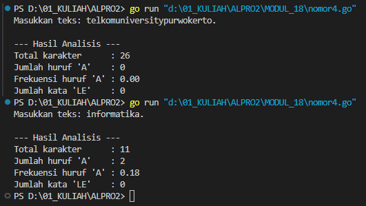

# <h1 align="center">Laporan Praktikum Modul 18 <br> MESIN ABSTRAK</h1>
<p align="center">INAYAH NAJMI ZAKIA - 103112430013</p>

## Dasar Teori
Mesin abstrak dalam bahasa Go merujuk pada model konseptual yang mendasari cara kerja runtime Go, termasuk bagaimana goroutine dikelola, memori diatur melalui garbage collector, dan bagaimana scheduler internal mengatur eksekusi fungsi secara konkuren. Meskipun Go tidak menggunakan mesin virtual seperti Java, Go memiliki runtime sendiri yang berfungsi seperti mesin abstrak—menyediakan lingkungan eksekusi yang mengabstraksi detail sistem operasi dan perangkat keras. Mesin ini memungkinkan fitur-fitur seperti konkurensi ringan dan manajemen memori otomatis berjalan efisien tanpa perlu campur tangan langsung dari programmer.

# Unguided
___
# SOAL LATIHAN MODUL 18
### No. 4
Implementasi mesin abstrak karakter yang bekerja terhadap untaian karakter (yang diakhiri dengan penanda titik (".") dan mempunyai sejumlah operasi dasar. a) Operasi dasar mesin karakter: ➢ Prosedur start(); yang menyiapkan mesin karakter di awal rangkaian karakter. ➢ Prosedur maju(); yang memajukan pembaca ke posisi karakter berikutnya. ➢ Fungsi eop(); yang mengembalikan nilai true apabila sudah mencapai akhir rangkaian, sampai ke penanda titik ("."). ➢ Fungsi cc(); yang mengembalikan karakter yang sedang terbaca, atau berada pada posisi pembacaan mesin. b) Dengan operasi dasar di atas buat algoritma untuk: ➢ Membaca seluruh karakter yang diberikan ke mesin karakter tersebut. ➢ Menghitung berapa banyak karakter yang terbaca. ➢ Menghitung ada berapa huruf "A" yang terbaca. ➢ Menghitung frekuensi kemunculan huruf "A" terhadap seluruh karakter terbaca. ➢ Menghitung ada berapa kata "LE" (pasangan berturutan huruf "L" dan "E") yang terbaca.
```go
package main

import (
	"bufio"
	"fmt"
	"os"
	"strings"
)

var (
	inputTeks   string
	posisi      int
	karakter    byte
)

func mulaiPembacaan() {
	posisi = 0
	karakter = inputTeks[posisi]
}

func majuKarakter() {
	posisi++
	if posisi < len(inputTeks) {
		karakter = inputTeks[posisi]
	}
}

func sudahSelesai() bool {
	return karakter == '.'
}

func ambilKarakter() byte {
	return karakter
}

func main() {
	pembaca := bufio.NewReader(os.Stdin)
	fmt.Print("Masukkan teks: ")
	masukan, _ := pembaca.ReadString('\n')
	masukan = strings.TrimSpace(masukan)

	if !strings.HasSuffix(masukan, ".") {
		fmt.Println("Teks harus diakhiri dengan titik ('.').")
		return
	}

	inputTeks = masukan

	mulaiPembacaan()

	totalHuruf := 0
	jumlahA := 0
	jumlahLE := 0
	var hurufSebelumnya byte = 0

	for !sudahSelesai() {
		hurufSekarang := ambilKarakter()

		totalHuruf++

		if hurufSekarang == 'A' || hurufSekarang == 'a' {
			jumlahA++
		}

		if (hurufSebelumnya == 'L' || hurufSebelumnya == 'l') && (hurufSekarang == 'E' || hurufSekarang == 'e') {
			jumlahLE++
		}

		hurufSebelumnya = hurufSekarang
		majuKarakter()
	}

	frekuensiA := float64(jumlahA) / float64(totalHuruf)

	fmt.Println("\n--- Hasil Analisis ---")
	fmt.Println("Total karakter      :", totalHuruf)
	fmt.Println("Jumlah huruf 'A'    :", jumlahA)
	fmt.Printf("Frekuensi huruf 'A' : %.2f\n", frekuensiA)
	fmt.Println("Jumlah kata 'LE'    :", jumlahLE)
}
```

> Output
> 

Program tersebut dibuat dengan bahasa Go dan berfungsi untuk menganalisis sebuah teks yang dimasukkan oleh pengguna. Teks yang dimasukkan harus diakhiri dengan tanda titik. Setelah input diterima, program akan membaca setiap karakter satu per satu menggunakan pendekatan seperti mesin pembaca karakter. Selama pembacaan, program akan menghitung total karakter (kecuali titik), jumlah huruf 'A' atau 'a', serta mendeteksi berapa kali pasangan huruf 'L' diikuti oleh 'E' muncul secara berurutan. Selain itu, program juga menghitung frekuensi kemunculan huruf 'A' dibandingkan dengan total karakter yang ada. Hasil analisis tersebut kemudian ditampilkan ke layar.
