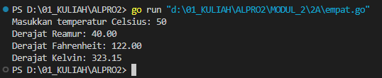
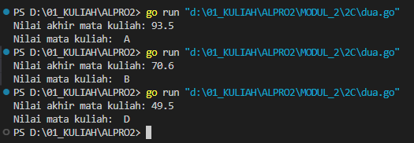

# <h1 align="center">Laporan Praktikum Modul 2 <br> REVIEW PENGENALAN PEMROGRAMAN</h1>
<p align="center">INAYAH NAJMI ZAKIA - 103112430013</p>

## Dasar Teori
Bahasa ini dirancang untuk sederhana, cepat, dan efisien, terutama dalam pengembangan sistem backend dan pemrograman konkuren. Go memiliki tipe data statis, garbage collection, serta mendukung goroutines untuk pemrosesan paralel yang ringan. Sintaksnya sederhana dan ringkas, sehingga mudah dipelajari. Selain itu, Go memiliki waktu kompilasi yang cepat, menjadikannya pilihan populer untuk pengembangan aplikasi skala besar. Tidak seperti bahasa pemrograman lain yang mendukung class dan inheritance, Go menggunakan konsep struct dan interface untuk membangun sistem berbasis objek secara lebih fleksibel. Selain itu, Go tidak memiliki exception handling seperti try-catch, melainkan menggunakan mekanisme error handling berbasis nilai yang harus ditangani secara eksplisit.

# Unguided
___
# SOAL 2A
### No. 1
Telusuri program berikut dengan cara mengkompilasi dan mengeksekusi program. Silakan masukan data yang sesuai sebanyak yang diminta program. Perhatikan keluaran yang diperoleh. Coba terangkan apa sebenarnya yang dilakukan program tersebut?

```go
package main

import "fmt"

func main() {
    var (
        satu, dua, tiga string
        temp string
    )
    fmt.Print("Masukan input string: ")
    fmt.Scanln(&satu)
    fmt.Print("Masukan input string: ")
    fmt.Scanln(&dua)
    fmt.Print("Masukan input string: ")
    fmt.Scanln(&tiga)
    fmt.Println("Output awal = " + satu + " " + dua + " " + tiga)
    temp = satu
    satu = dua
    dua = tiga
    tiga = temp
    fmt.Println("Output akhir = " + satu + " " + dua + " " + tiga)
}
```

> Output
> 

Kode di atas adalah program dalam bahasa Go yang meminta pengguna untuk memasukkan tiga string, kemudian menukar posisi string tersebut secara bergilir. Setelah menerima input tiga string menggunakan `fmt.Scanln()`, program mencetak urutan awalnya. Pertukaran dilakukan dengan menyimpan nilai pertama dalam variabel `temp`, lalu menggeser nilai `satu` ke `dua`, `dua` ke `tiga`, dan nilai awal `satu` yang disimpan di `temp` dipindahkan ke `tiga`. Akhirnya, program mencetak hasil setelah pertukaran dilakukan.

### No. 2
Tahun kabisat adalah tahun yang habis dibagi 400 atau habis dibagi 4 tetapi tidak habis dibagi 100. Buatlah sebuah program yang menerima input sebuah bilangan bulat dan memeriksa apakah bilangan tersebut merupakan tahun kabisat (true) atau bukan (false).

```go
package main  
import ("fmt")

func isLeapYear(year int) bool {
    if year%400 == 0 {
        return true
    } else if year%100 == 0 {
        return false
    } else if year%4 == 0 {
        return true
    }
    return false
}
func main() {
    var year int
    fmt.Print("Masukkan tahun: ")
    fmt.Scan(&year)
    if isLeapYear(year) {
        fmt.Println(year, "adalah tahun kabisat (true)")
    } else {
        fmt.Println(year, "bukan tahun kabisat (false)")
    }
}
```

> Output
> 

Kode di atas adalah program dalam bahasa Go yang menentukan apakah suatu tahun merupakan tahun kabisat atau bukan. Fungsi `isLeapYear(year int) bool` digunakan untuk mengecek aturan tahun kabisat, di mana:

1. Tahun yang habis dibagi 400 adalah tahun kabisat.
2. Tahun yang habis dibagi 100 tetapi tidak habis dibagi 400 bukan tahun kabisat.
3. Tahun yang habis dibagi 4 adalah tahun kabisat, kecuali yang masuk aturan kedua.

Di dalam fungsi `main()`, program meminta input tahun dari pengguna menggunakan `fmt.Scan(&year)`. Kemudian, hasilnya dicek dengan memanggil `isLeapYear(year)`, jika bernilai `true`, maka program mencetak bahwa tahun tersebut adalah tahun kabisat; jika `false`, maka bukan tahun kabisat.

### No. 3
Buat program Bola yang menerima input jari-jari suatu bola (bilangan bulat). Tampilkan Volume dan Luas kulit bola. 𝑣𝑜𝑙𝑢𝑚𝑒𝑏𝑜𝑙𝑎 = 4 3 𝜋𝑟 3 dan 𝑙𝑢𝑎𝑠𝑏𝑜𝑙𝑎 = 4𝜋𝑟 2 (π ≈ 3.1415926535).

```go
package main
import (
    "fmt"
    "math")

func main() {
    var r int
    const pi = 3.1415926535
    fmt.Print("Masukkan jari-jari bola: ")
    fmt.Scan(&r)
    volume := (4.0 / 3.0) * pi * math.Pow(float64(r), 3)
    luas := 4 * pi * math.Pow(float64(r), 2)
    fmt.Printf("Bola dengan jari-jari %d memiliki volume %.4f dan luas kulit %.4f\n", r, volume, luas)
}
```

> Output
> 

Kode di atas adalah program Go yang menghitung volume dan luas permukaan bola berdasarkan jari-jari yang dimasukkan pengguna. Program menggunakan konstanta `pi` dan fungsi `math.Pow()` untuk perpangkatan. Volume dihitung dengan rumus 43πr3\frac{4}{3} \pi r^3, sedangkan luas permukaan dihitung dengan 4πr24\pi r^2. Hasilnya ditampilkan dengan format desimal hingga 4 angka di belakang koma.

### No. 4
Dibaca nilai temperatur dalam derajat Celsius. Nyatakan temperatur tersebut dalam Fahrenheit 𝐶𝑒𝑙𝑠𝑖𝑢𝑠 = (𝐹𝑎ℎ𝑟𝑒𝑛ℎ𝑒𝑖𝑡 − 32) × 5/9 𝑅𝑒𝑎𝑚𝑢𝑟 = 𝐶𝑒𝑙𝑐𝑖𝑢𝑠 × 4/5 𝐾𝑒𝑙𝑣𝑖𝑛 = (𝐹𝑎ℎ𝑟𝑒𝑛ℎ𝑒𝑖𝑡 + 459.67) × 5/9
Lanjutkan program di atas, sehingga temperatur dinyatakan juga dalam derajat Reamur dan Kelvin.
```go
package main
import (
    "fmt"
)

func main() {
    var celsius float64
    fmt.Print("Masukkan temperatur Celsius: ")
    fmt.Scan(&celsius)
    reamur := celsius * 4 / 5
    fahrenheit := (celsius * 9 / 5) + 32
    kelvin := celsius + 273.15
    fmt.Printf("Derajat Reamur: %.2f\n", reamur)
    fmt.Printf("Derajat Fahrenheit: %.2f\n", fahrenheit)
    fmt.Printf("Derajat Kelvin: %.2f\n", kelvin)
}
```

> Output
> 

Kode di atas adalah program Go untuk mengonversi suhu dari Celsius ke Reamur, Fahrenheit, dan Kelvin. Program meminta pengguna memasukkan suhu dalam Celsius, lalu menghitung konversinya dengan rumus:
- Reamur = 45×\frac{4}{5} \times Celsius
- Fahrenheit = 95×\frac{9}{5} \times Celsius + 32
- Kelvin = Celsius + 273.15
Hasil konversi ditampilkan dengan dua angka di belakang koma menggunakan `fmt.Printf()`.

### No. 5
Tipe karakter sebenarnya hanya apa yang tampak dalam tampilan. Di dalamnya tersimpan dalam bentuk biner 8 bit (byte) atau 32 bit (rune) saja. Buat program ASCII yang akan membaca 5 buat data integer dan mencetaknya dalam format karakter. Kemudian membaca 3 buah data karakter dan mencetak 3 buah karakter setelah karakter tersebut (menurut tabel ASCII) Masukan terdiri dari dua baris. Baris pertama berisi 5 buah data integer. Data integer mempunyai nilai antara 32 s.d. 127. Baris kedua berisi 3 buah karakter yang berdampingan satu dengan yang lain (tanpa dipisahkan spasi). Keluaran juga terdiri dari dua baris. Baris pertama berisi 5 buah representasi karakter dari data yang diberikan, yang berdampingan satu dengan lain, tanpa dipisahkan spasi. Baris kedua berisi 3 buah karakter (juga tidak dipisahkan oleh spasi).
```go
package main
import "fmt"
func main(){
    var c1, c2, c3, c4, c5 byte
    var b1, b2, b3 int
    fmt.Scan(&c1, &c2, &c3, &c4, &c5)
    fmt.Scanf("%c",&b1)
    fmt.Scanf("%c",&b2)
    fmt.Scanf("%cc",&b3)
    fmt.Printf("%c%c%c%c%c",c1, c2, c3, c4, c5)
    fmt.Printf("%c%c%c",b1+1, b2+1, b3+1)
}
```

> Output
> 

Kode di atas adalah program Go yang membaca lima angka ASCII dan tiga karakter, lalu mengonversi serta mencetaknya dalam format tertentu.
- Lima nilai pertama (`c1` hingga `c5`) dibaca sebagai tipe `byte` (alias `uint8`) dan langsung dicetak sebagai karakter ASCII.
- Tiga karakter berikutnya (`b1`, `b2`, `b3`) dibaca menggunakan `fmt.Scanf()` dengan format `%c`, lalu ditampilkan setelah ditambah 1 berdasarkan kode ASCII (menghasilkan karakter setelahnya dalam tabel ASCII).
- Ada kesalahan pada `fmt.Scanf("%cc",&b3)`, karena `%cc` tidak valid. Seharusnya cukup `%c` saja.

# SOAL 2B
### No. 1
Siswa kelas IPA di salah satu sekolah menengah atas di Indonesia sedang mengadakan praktikum kimia. Di setiap percobaan akan menggunakan 4 tabung reaksi, yang mana susunan warna cairan di setiap tabung akan menentukan hasil percobaan. Siswa diminta untuk mencatat hasil percobaan tersebut. Percobaan dikatakan berhasil apabila susunan warna zat cair pada gelas 1 hingga gelas 4 secara berturutan adalah ‘merah’, ‘kuning’, ‘hijau’, dan ‘ungu’ selama 5 kali percobaan berulang. Buatlah sebuah program yang menerima input berupa warna dari ke 4 gelas reaksi sebanyak 5 kali percobaan. Kemudian program akan menampilkan true apabila urutan warna sesuai dengan informasi yang diberikan pada paragraf sebelumnya, dan false untuk urutan warna lainnya.

```go
package main
import (
    "fmt"
)
func main() {
    var a, b, c, d string
    warna := true
    for i := 1; i <= 5; i++ {
        fmt.Printf("Percobaan %d: ", i)
        fmt.Scan(&a, &b, &c, &d)
        if a != "merah" || b != "kuning" || c != "hijau" || d != "ungu" {
            warna = false
        }
    }
    fmt.Println("BERHASIL: ", warna)
}
```

> Output
> 

Kode di atas adalah program Go yang meminta pengguna memasukkan empat kata dalam lima percobaan, lalu mengevaluasi apakah semua input dalam setiap percobaan sesuai dengan urutan `"merah"`, `"kuning"`, `"hijau"`, dan `"ungu"`.
- Variabel `warna` diinisialisasi dengan `true`, menandakan bahwa input awalnya dianggap benar.
- Loop `for` berjalan sebanyak 5 kali untuk menerima input pengguna (`a, b, c, d`).
- Jika dalam satu percobaan ada input yang tidak sesuai dengan urutan yang diharapkan, variabel `warna` diubah menjadi `false`.
- Setelah semua percobaan selesai, program mencetak `"BERHASIL: true"` jika semua percobaan memiliki input yang benar, atau `"BERHASIL: false"` jika ada yang salah.

### No. 2
Suatu pita (string) berisi kumpulan nama-nama bunga yang dipisahkan oleh spasi dan ‘– ‘, contoh pita diilustrasikan seperti berikut ini. Pita: mawar – melati – tulip – teratai – kamboja – anggrek Buatlah sebuah program yang menerima input sebuah bilangan bulat positif (dan tidak nol) N, kemudian program akan meminta input berupa nama bunga secara berulang sebanyak N kali dan nama tersebut disimpan ke dalam pita. (Petunjuk: gunakan operasi penggabungan string dengan operator “+” ). Tampilkan isi pita setelah proses input selesai.
Modifikasi program sebelumnya, proses input akan berhenti apabila user mengetikkan ‘SELESAI’. Kemudian tampilkan isi pita beserta banyaknya bunga yang ada di dalam pita
```go
package main
import "fmt"
func main() {
    var bunga, pita string
    i := 0
    for selesai := false; !selesai; {
        i += 1
        fmt.Printf("Bunga %d: ", i)
        fmt.Scan(&bunga)
        if bunga != "SELESAI" {
            pita += bunga + "-"
        }
        selesai = bunga == "SELESAI"
    }
    fmt.Println("Pita: ", pita)
    fmt.Println("Bunga: ", i-1)
}
```

> Output
> 

Kode di atas adalah program Go yang meminta pengguna memasukkan nama bunga secara berulang hingga pengguna mengetik `"SELESAI"`.

- Variabel `bunga` digunakan untuk menyimpan input bunga, sedangkan `pita` digunakan untuk menggabungkan nama bunga dengan tanda `"-"`.
- Loop berjalan dengan kondisi `selesai == false`, di mana setiap iterasi menambah nilai `i` sebagai penghitung jumlah bunga yang dimasukkan.
- Jika input bukan `"SELESAI"`, maka nama bunga ditambahkan ke `pita` dengan pemisah `"-"`.
- Jika input adalah `"SELESAI"`, loop berhenti.
- Program mencetak hasil pita yang berisi daftar bunga yang telah dimasukkan serta jumlah bunga yang dihitung dari `i-1` (karena `"SELESAI"` tidak dihitung sebagai bunga).

### No. 3
Setiap hari Pak Andi membawa banyak barang belanjaan dari pasar dengan mengendarai sepeda motor. Barang belanjaan tersebut dibawa dalam kantong terpal di kiri-kanan motor. Sepeda motor tidak akan oleng jika selisih berat barang di kedua kantong sisi tidak lebih dari 9 kg. Buatlah program Pak Andi yang menerima input dua buah bilangan real positif yang menyatakan berat total masing-masing isi kantong terpal. Program akan terus meminta input bilangan tersebut hingga salah satu kantong terpal berisi 9 kg atau lebih. Pada modifikasi program tersebut, program akan menampilkan true jika selisih kedua isi kantong lebih dari atau sama dengan 9 kg. Program berhenti memproses apabila total berat isi kedua kantong melebihi 150 kg atau salah satu kantong beratnya negatif

```go
package main
import (
    "fmt"
)
func main() {
    for selesai := false; !selesai; {
        var a, b float64
        fmt.Print("Masukan berat belanjaan di kedua kantong: ")
        fmt.Scan(&a, &b)
        fmt.Println("Sepeda motor pak Andi akan oleng:", b-a >= 9)
        selesai = (a+b > 150) || (a < 0 || b < 0)
    }
    fmt.Println("Program selesai")
}
```

> Output
> 

Kode di atas adalah program Go yang mengevaluasi keseimbangan beban pada sepeda motor Pak Andi berdasarkan berat belanjaan di dua kantong.
- Program berjalan dalam loop yang terus meminta pengguna memasukkan dua nilai berat (`a` dan `b`).
- Setelah input diberikan, program mengecek apakah selisih berat antara kantong kanan (`b`) dan kantong kiri (`a`) lebih dari atau sama dengan 9. Jika iya, program mencetak bahwa sepeda motor akan oleng (`true` atau `false`).
- Loop akan berhenti (`selesai = true`) jika total berat melebihi 150 kg atau jika ada input negatif, menandakan kondisi tidak valid.
- Setelah loop berakhir, program mencetak `"Program selesai"`.

### No. 4
Diberikan sebuah persamaan sebagai berikut ini. 𝑓(𝑘) = (4𝑘 + 2) 2 (4𝑘 + 1)(4𝑘 + 3) Buatlah sebuah program yang menerima input sebuah bilangan sebagai K, kemudian menghitung dan menampilkan nilai f(K) sesuai persamaan di atas. √2 merupakan bilangan irasional. Meskipun demikian, nilai tersebut dapat dihampiri dengan rumus berikut: √2 = ∏ (4𝑘 + 2) 2 (4𝑘 + 1)(4𝑘 + 3) ∞ 𝑘=0 Modifikasi program sebelumnya yang menerima input integer 𝐾 dan menghitung √2 untuk 𝐾 tersebut. Hampiran √2 dituliskan dalam ketelitian 10 angka di belakang koma.
```go
package main
import (
    "fmt"
)
func f(k int) float64 {
    numerator := float64((4*k + 2) * (4*k + 2))
    denominator := float64((4*k + 1) * (4*k + 3))
    return numerator / denominator
}
func approxSqrt2(K int) float64 {
    result := 1.0
    for k := 0; k < K; k++ {
        result *= f(k)
    }
    return result
}
func main() {
    var K int
    fmt.Print("Masukkan nilai K: ")
    fmt.Scan(&K)
    sqrt2Approx := approxSqrt2(K)
    fmt.Printf("Nilai K = %d\n", K)
    fmt.Printf("Nilai akar 2 = %.10f\n", sqrt2Approx)
}
```

> Output
> 

**Penjelasan kode:**

- Fungsi `f(k)` menghitung satu suku dari perkalian menggunakan rumus (4k+2)2(4k+1)(4k+3)\frac{(4k+2)^2}{(4k+1)(4k+3)}(4k+1)(4k+3)(4k+2)2​.
- Fungsi `approxSqrt2(K)` melakukan perkalian berulang dari hasil fungsi `f(k)` untuk **K** iterasi dan menyimpannya dalam `result`.
- Fungsi `main()` meminta input integer `K` dari pengguna, lalu menghitung pendekatan akar 2 menggunakan `approxSqrt2(K)`, dan mencetak hasilnya dengan 10 angka di belakang koma.

# SOAL 2C
### No. 1
PT POS membutuhkan aplikasi perhitungan biaya kirim berdasarkan berat parsel. Maka, buatlah program BiayaPos untuk menghitung biaya pengiriman tersebut dengan ketentuan sebagai berikut! Dari berat parsel (dalam gram), harus dihitung total berat dalam kg dan sisanya (dalam gram). Biaya jasa pengiriman adalah Rp. 10.000,- per kg. Jika sisa berat tidak kurang dari 500 gram, maka tambahan biaya kirim hanya Rp. 5,- per gram saja. Tetapi jika kurang dari 500 gram, maka tambahan biaya akan dibebankan sebesar Rp. 15,- per gram. Sisa berat (yang kurang dari 1kg) digratiskan biayanya apabila total berat ternyata lebih dari 10kg.

```go
package main
import (
    "fmt"
)
func main() {
    var beratGram int
    fmt.Print("Masukkan berat parsel (gram): ")
    fmt.Scan(&beratGram)
    beratKg := beratGram / 1000
    sisaGram := beratGram % 1000
    biayaKg := beratKg * 10000
    var biayaSisa int
    if beratKg > 10 {
        biayaSisa = 0
    } else {
        if sisaGram >= 500 {
            biayaSisa = sisaGram * 5
        } else {
            biayaSisa = sisaGram * 15
        }
    }
    totalBiaya := biayaKg + biayaSisa
    fmt.Printf("Detail berat: %d kg + %d gr\n", beratKg, sisaGram)
    fmt.Printf("Detail biaya: Rp. %d + Rp. %d\n", biayaKg, biayaSisa)
    fmt.Printf("Total biaya: Rp. %d\n", totalBiaya)
}
```

> Output
> 

Kode di atas adalah program dalam bahasa Go yang menghitung biaya pengiriman parsel berdasarkan beratnya dalam gram.
**Penjelasan:**
1. **Input berat** – Program meminta pengguna memasukkan berat parsel dalam gram.
2. **Konversi berat** – Berat dalam gram dikonversi menjadi kilogram (`beratKg`) dan sisa gram (`sisaGram`).
3. **Hitung biaya dasar** – Setiap kilogram dikenakan biaya Rp. 10.000 (`biayaKg`).
4. **Hitung biaya tambahan** – Jika `sisaGram` ≥ 500 gram, biayanya dihitung dengan tarif Rp. 5 per gram, sedangkan jika < 500 gram, tarifnya Rp. 15 per gram. Namun, jika berat lebih dari 10 kg, biaya tambahan diabaikan (`biayaSisa = 0`).
5. **Hitung total biaya** – Biaya total dihitung dari biaya kilogram dan biaya sisa gram.
6. **Output hasil** – Program menampilkan detail berat, perhitungan biaya, dan total biaya pengiriman.

### No. 2
Diberikan sebuah nilai akhir mata kuliah (NAM). Program berikut menerima input sebuah bilangan riil yang menyatakan NAM. Program menghitung NMK dan menampilkannya.
Jawablah pertanyaan-pertanyaan berikut:
a. Jika nam diberikan adalah 80.1, apa keluaran dari program tersebut? Apakah eksekusi program tersebut sesuai spesifikasi soal?
b. Apa saja kesalahan dari program tersebut? Mengapa demikian? Jelaskan alur program seharusnya!
c. Perbaiki program tersebut! Ujilah dengan masukan: 93.5; 70.6; dan 49.5. Seharusnya keluaran yang diperoleh adalah ‘A’, ‘B’, dan ‘D’.
```go
package main
import "fmt"
func main() {
    var nam float64
    var nmk string
    fmt.Print("Nilai akhir mata kuliah: ")
    fmt.Scan(&nam)
    if nam > 88 {
        nmk = "A"
    } else if nam > 72.5 {
        nmk = "AB"
    } else if nam > 65 {
        nmk = "B"
    } else if nam > 57.5 {
        nmk = "BC"
    } else if nam > 50 {
        nmk = "C"
    } else if nam > 40 {
        nmk = "D"
    } else {
        nmk = "E"
    }
    fmt.Println("Nilai mata kuliah: ", nmk)
}
```

> Output
> 

Kode di atas adalah program dalam bahasa Go yang mengonversi nilai akhir mata kuliah menjadi nilai huruf berdasarkan rentang nilai tertentu.
**Penjelasan:**

1. **Input nilai** – Program meminta pengguna memasukkan nilai akhir mata kuliah (`nam`).
2. **Penentuan nilai huruf** –
    - Jika nilai > 88 → **A**
    - Jika nilai > 72.5 → **AB**
    - Jika nilai > 65 → **B**
    - Jika nilai > 57.5 → **BC**
    - Jika nilai > 50 → **C**
    - Jika nilai > 40 → **D**
    - Jika nilai ≤ 40 → **E**
3. **Output hasil** – Program mencetak nilai mata kuliah dalam bentuk huruf (`nmk`).
Jawab 
**a.** Jika `nam = 80.1`, outputnya **"A"**, tetapi seharusnya **"AB"**. Program tidak sesuai dengan spesifikasi soal.
**b.** Kesalahan program:
1. Batas bawah interval tidak diperhitungkan dengan benar (seharusnya `<=` atau `>=` sesuai tabel).
2. Kondisi kategori "E" salah (seharusnya `NAM < 40`).

### No. 3
Sebuah bilangan bulat b memiliki faktor bilangan f > 0 jika f habis membagi b. Contoh: 2 merupakan faktor dari bilangan 6 karena 6 habis dibagi 2. Buatlah program yang menerima input sebuah bilangan bulat b dan b > 1. Program harus dapat mencari dan menampilkan semua faktor dari bilangan tersebut! Bilangan bulat b > 0 merupakan bilangan prima p jika dan hanya jika memiliki persis dua faktor bilangan saja, yaitu 1 dan dirinya sendiri. Lanjutkan program sebelumnya. Setelah menerima masukan sebuah bilangan bulat b > 0. Program tersebut mencari dan menampilkan semua faktor bilangan tersebut. Kemudian, program menentukan apakah b merupakan bilangan prima.

```go
package main
import (
    "fmt"
)
func main() {
    var b int
    fmt.Print("Masukkan bilangan bulat (b > 0): ")
    fmt.Scan(&b)
    if b <= 0 {
        fmt.Println("Bilangan harus lebih besar dari 0!")
        return
    }
    fmt.Print("Faktor: ")
    faktor := []int{}
    for i := 1; i <= b; i++ {
        if b%i == 0 {
            faktor = append(faktor, i)
            fmt.Print(i, " ")
        }
    }
    fmt.Println()
    isPrima := len(faktor) == 2
    fmt.Println("Prima:", isPrima)
}
```

> Output
> 

- Pengguna memasukkan bilangan bulat positif. Jika bilangan yang dimasukkan kurang dari atau sama dengan nol, program akan menampilkan pesan kesalahan dan berhenti.
- Program mencari semua faktor dari bilangan tersebut dengan melakukan iterasi dari `1` hingga `b`. Jika `b` habis dibagi oleh suatu angka, angka tersebut akan dimasukkan ke dalam daftar faktor dan ditampilkan.
- Setelah semua faktor ditemukan, program memeriksa apakah jumlah faktor tersebut hanya **2** (yaitu `1` dan bilangan itu sendiri). Jika iya, bilangan tersebut adalah **bilangan prima**; jika tidak, maka bukan bilangan prima.
- Program kemudian mencetak hasil apakah bilangan tersebut prima (`true`) atau bukan (`false`).