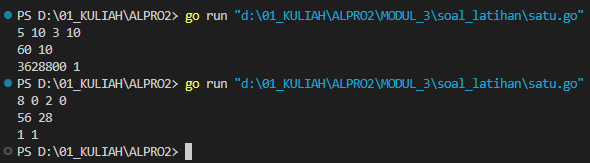
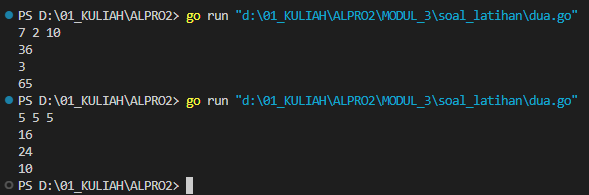
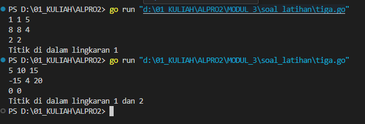

# <h1 align="center">Laporan Praktikum Modul 3 <br> FUNGSI</h1>
<p align="center">INAYAH NAJMI ZAKIA - 103112430013</p>

## Dasar Teori
Dalam bahasa pemrograman Go, fungsi (_function_) adalah blok kode yang dapat dieksekusi secara independen untuk meningkatkan modularitas dan reusability. Fungsi dideklarasikan dengan kata kunci `func`, diikuti oleh nama fungsi, parameter (jika ada), tipe return (jika ada), dan blok kode `{}` yang berisi instruksi. Go mendukung berbagai jenis fungsi, seperti fungsi tanpa parameter dan return, fungsi dengan parameter untuk menerima input, serta fungsi dengan return value untuk mengembalikan hasil eksekusi. Selain itu, Go memungkinkan multiple return, yang dapat mengembalikan lebih dari satu nilai sekaligus, serta fungsi variadic yang dapat menerima jumlah parameter yang tidak tetap. Penggunaan fungsi dalam Go membantu membuat kode lebih terstruktur, mudah dibaca, dan lebih mudah untuk diuji atau diperbaiki, sehingga meningkatkan efisiensi pengembangan perangkat lunak.

# Unguided
___
# SOAL LATIHAN MODUL 3
### No. 1
Minggu ini, mahasiswa Fakultas Informatika mendapatkan tugas dari mata kuliah matematika diskrit untuk mempelajari kombinasi dan permutasi. Jonas salah seorang mahasiswa, iseng untuk mengimplementasikannya ke dalam suatu program. Oleh karena itu bersediakah kalian membantu Jonas? (tidak tentunya ya :p)

Masukan terdiri dari empat buah bilangan asli 𝑎, 𝑏, 𝑐, dan 𝑑 yang dipisahkan oleh spasi, dengan syarat 𝑎 ≥ 𝑐 dan 𝑏 ≥ 𝑑. 
Keluaran terdiri dari dua baris. Baris pertama adalah hasil permutasi dan kombinasi 𝒂 terhadap 𝑐, sedangkan baris kedua adalah hasil permutasi dan kombinasi 𝑏 terhadap 𝑑. 

Catatan: permutasi (P) dan kombinasi (C) dari 𝑛 terhadap 𝑟 (𝑛 ≥ 𝑟) dapat dihitung dengan menggunakan persamaan berikut! 𝑃(𝑛, 𝑟) = 𝑛! (𝑛−𝑟)! , sedangkan 𝐶(𝑛, 𝑟) = 𝑛! 𝑟!(𝑛−𝑟)!

```go
package main

import (
    "fmt"
)
func factorial(n int) int {
    if n == 0 || n == 1 {
        return 1
    }
    result := 1
    for i := 2; i <= n; i++ {
        result *= i
    }
    return result
}

func permutation(n, r int) int {
    return factorial(n) / factorial(n-r)
}

func combination(n, r int) int {
    return factorial(n) / (factorial(r) * factorial(n-r))
}

func main() {
    var a, b, c, d int
    fmt.Scan(&a, &b, &c, &d)  
    if a >= c && b >= d {
        fmt.Println(permutation(a, c), combination(a, c))
        fmt.Println(permutation(b, d), combination(b, d))
        } else {
            fmt.Println("Input tidak memenuhi syarat a >= c dan b >= d")
        }
}```

> Output
> 

Kode di atas menghitung **permutasi** dan **kombinasi** dari dua pasangan bilangan `(a, c)` dan `(b, d)`, dengan syarat `a >= c` dan `b >= d`.
 **Fungsi `factorial(n)`** → Menghitung faktorial dari `n`.  
**Fungsi `permutation(n, r)`** → Menghitung permutasi P(n,r)=n!(n−r)!P(n, r) = \frac{n!}{(n-r)!}.   **Fungsi `combination(n, r)`** → Menghitung kombinasi C(n,r)=n!r!(n−r)!C(n, r) = \frac{n!}{r!(n-r)!}.  **Di `main()`**:
- Membaca input `a, b, c, d`.
- Jika `a >= c` dan `b >= d`, maka mencetak hasil permutasi & kombinasi untuk `(a, c)` dan `(b, d)`.
- Jika tidak memenuhi syarat, menampilkan pesan error.

### No. 2
Diberikan tiga buah fungsi matematika yaitu 𝑓 (𝑥) = 𝑥 2 , 𝑔 (𝑥) = 𝑥 − 2 dan ℎ (𝑥) = 𝑥 + 1. Fungsi komposisi (𝑓𝑜𝑔𝑜ℎ)(𝑥) artinya adalah 𝑓(𝑔(ℎ(𝑥))). Tuliskan 𝑓(𝑥), 𝑔(𝑥) dan ℎ(𝑥) dalam bentuk function. Masukan terdiri dari sebuah bilangan bulat 𝑎, 𝑏 dan 𝑐 yang dipisahkan oleh spasi. Keluaran terdiri dari tiga baris. Baris pertama adalah (𝑓𝑜𝑔𝑜ℎ)(𝑎), baris kedua (𝑔𝑜ℎ𝑜𝑓)(𝑏), dan baris ketiga adalah (ℎ𝑜𝑓𝑜𝑔)(𝑐)!

```go
package main
import (
    "fmt"
)
func f(x int) int {
    return x * x
}
func g(x int) int {
    return x - 2
}
func h(x int) int {
    return x + 1
}
func fogoh(x int) int {
    return f(g(h(x)))
}
func gohof(x int) int {
    return g(h(f(x)))
}
func hofog(x int) int {
    return h(f(g(x)))
}
func main() {
    var a, b, c int
    fmt.Scan(&a, &b, &c)
    fmt.Println(fogoh(a))
    fmt.Println(gohof(b))
    fmt.Println(hofog(c))
}
```

> Output
> 

Kode di atas mendefinisikan tiga fungsi matematika:
- **f(x) = x²** (kuadratkan nilai x)
- **g(x) = x - 2** (kurangi x dengan 2)
- **h(x) = x + 1** (tambah x dengan 1)
Kemudian, tiga fungsi komposisi dihitung:
- **fogoh(x) = f(g(h(x)))**
- **gohof(x) = g(h(f(x)))**
- **hofog(x) = h(f(g(x)))**
Di dalam `main()`, program membaca tiga bilangan `a, b, c`, lalu mencetak hasil dari **fogoh(a)**, **gohof(b)**, dan **hofog(c)**.

### No. 3
[Lingkaran] Suatu lingkaran didefinisikan dengan koordinat titik pusat (𝑐𝑥, 𝑐𝑦) dengan radius 𝑟. Apabila diberikan dua buah lingkaran, maka tentukan posisi sebuah titik sembarang (𝑥, 𝑦) berdasarkan dua lingkaran tersebut. Masukan terdiri dari beberapa tiga baris. Baris pertama dan kedua adalah koordinat titik pusat dan radius dari lingkaran 1 dan lingkaran 2, sedangkan baris ketiga adalah koordinat titik sembarang. Asumsi sumbu x dan y dari semua titik dan juga radius direpresentasikan dengan bilangan bulat. Keluaran berupa string yang menyatakan posisi titik "Titik di dalam lingkaran 1 dan 2", "Titik di dalam lingkaran 1", "Titik di dalam lingkaran 2", atau "Titik di luar lingkaran 1 dan 2"

```go
package main
import (
    "fmt"
    "math"
)
func jarak(x1, y1, x2, y2 int) float64 {
    return math.Sqrt(float64((x1-x2)*(x1-x2) + (y1-y2)*(y1-y2)))
}
func dalamLingkaran(x, y, cx, cy, r int) bool {
    return jarak(x, y, cx, cy) <= float64(r)
}
func main() {
    var cx1, cy1, r1 int
    var cx2, cy2, r2 int
    var x, y int        
    fmt.Scan(&cx1, &cy1, &r1)
    fmt.Scan(&cx2, &cy2, &r2)
    fmt.Scan(&x, &y)
    diLingkaran1 := dalamLingkaran(x, y, cx1, cy1, r1)
    diLingkaran2 := dalamLingkaran(x, y, cx2, cy2, r2)
    if diLingkaran1 && diLingkaran2 {
        fmt.Println("Titik di dalam lingkaran 1 dan 2")
    } else if diLingkaran1 {
        fmt.Println("Titik di dalam lingkaran 1")
    } else if diLingkaran2 {
        fmt.Println("Titik di dalam lingkaran 2")
    } else {
        fmt.Println("Titik di luar lingkaran 1 dan 2")
    }
}
```

> Output
> 

Kode di atas mengecek apakah suatu titik berada di dalam satu atau dua lingkaran berdasarkan koordinat pusat dan radiusnya.
- **`jarak()`**: Menghitung jarak antara dua titik menggunakan rumus Euclidean.
- **`dalamLingkaran()`**: Mengecek apakah titik berada dalam lingkaran dengan membandingkan jarak ke pusat dengan radius.
- **`main()`**:
    - Membaca input dua lingkaran `(pusat, radius)` dan satu titik.
    - Menentukan posisi titik dan mencetak hasil:
        - "Titik di dalam lingkaran 1 dan 2"
        - "Titik di dalam lingkaran 1"
        - "Titik di dalam lingkaran 2"
        - "Titik di luar lingkaran 1 dan 2"
