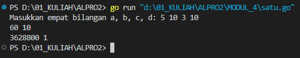
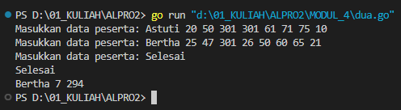
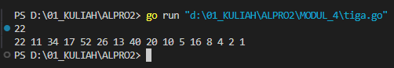

# <h1 align="center">Laporan Praktikum Modul 4 <br> PROSEDUR</h1>
<p align="center">INAYAH NAJMI ZAKIA - 103112430013</p>

## Dasar Teori
Prosedur dapat dianggap sebagai potongan beberapa instruksi program menjadi suatu instruksi baru yang dibuat untuk mengurangi kerumitan dari kode program yang kompleks pada suatu program yang besar. Prosedur akan menghasilkan suatu akibat atau efek langsung pada program ketika dipanggil pada program utama. Kedudukannya prosedur sama seperti instruksi dasar yang sudah ada sebelumnya (assignment) dan/atau instruksi yang berasal dari paket (fmt), seperti fmt.Scan dan fmt.Print. Karena itu selalu pilih nama prosedur yang berbentuk kata kerja atau sesuatu yang merepresentasikan proses sebagai nama dari prosedur.

# Unguided
___
# SOAL LATIHAN MODUL 4
### No. 1
Minggu ini, mahasiswa Fakultas Informatika mendapatkan tugas dari mata kuliah matematika diskrit untuk mempelajari kombinasi dan permutasi. Jonas salah seorang mahasiswa, iseng untuk mengimplementasikannya ke dalam suatu program.

Masukan terdiri dari empat buah bilangan asli 𝑎, 𝑏, 𝑐, dan 𝑑 yang dipisahkan oleh spasi, dengan syarat 𝑎 ≥ 𝑐 dan 𝑏 ≥ 𝑑.
Keluaran terdiri dari dua baris. Baris pertama adalah hasil permutasi dan kombinasi 𝒂 terhadap 𝑐, sedangkan baris kedua adalah hasil permutasi dan kombinasi 𝑏 terhadap 𝑑.

Catatan: permutasi (P) dan kombinasi (C) dari 𝑛 terhadap 𝑟 (𝑛 ≥ 𝑟) dapat dihitung dengan menggunakan persamaan berikut!
𝑃(𝑛, 𝑟) = 𝑛!/(𝑛−𝑟)! , sedangkan 𝐶(𝑛, 𝑟) = 𝑛!/𝑟!(𝑛−𝑟)!


```go
package main
import (
    "fmt"
)
func factorial(n int) int {
    if n == 0 || n == 1 {
        return 1
    }
    hasil := 1
    for i := 2; i <= n; i++ {
        hasil *= i
    }
    return hasil
}
func permutation(n, r int) int {
    if n < r {
        return 0
    }
    return factorial(n) / factorial(n-r)
}
func combination(n, r int) int {
    if n < r {
        return 0
    }
    return factorial(n) / (factorial(r) * factorial(n-r))
}
func main() {
    var a, b, c, d int
    fmt.Print("Masukkan empat bilangan a, b, c, d: ")
    fmt.Scan(&a, &b, &c, &d)
    if a < c || b < d {
        fmt.Println("Input tidak valid: Pastikan a >= c dan b >= d")
        return
    }
    p1 := permutation(a, c)
    c1 := combination(a, c)
    p2 := permutation(b, d)
    c2 := combination(b, d)
    fmt.Println(p1, c1)
    fmt.Println(p2, c2)
}
}
```

> Output
> 

Program Go ini menghitung **permutasi** dan **kombinasi** dari dua pasang bilangan yang dimasukkan oleh pengguna.

- **`factorial(n)`** → Menghitung faktorial `n!` secara iteratif.
- **`permutation(n, r)`** → Menghitung permutasi: P(n,r)=n!(n−r)!P(n, r) = \frac{n!}{(n-r)!}P(n,r)=(n−r)!n!​.
- **`combination(n, r)`** → Menghitung kombinasi: C(n,r)=n!r!(n−r)!C(n, r) = \frac{n!}{r!(n-r)!}C(n,r)=r!(n−r)!n!​.
- **`main()`** → Menerima input `a, b, c, d`, memvalidasi input (`a >= c` dan `b >= d`), lalu mencetak hasil permutasi dan kombinasi untuk `(a, c)` serta `(b, d)`.

### No. 2
Kompetisi pemrograman tingkat nasional berlangsung ketat. Setiap peserta diberikan 8 soal yang harus dapat diselesaikan dalam waktu 5 jam saja. Peserta yang berhasil menyelesaikan soal paling banyak dalam waktu paling singkat adalah pemenangnya. Buat program gema yang mencari pemenang dari daftar peserta yang diberikan. Program harus dibuat modular, yaitu dengan membuat prosedur hitungSkor yang mengembalikan total soal dan total skor yang dikerjakan oleh seorang peserta, melalui parameter formal. Pembacaan nama peserta dilakukan di program utama, sedangkan waktu pengerjaan dibaca di dalam prosedur.

prosedure hitungSkor(in/out soal, skor : integer)

Setiap baris masukan dimulai dengan satu string nama peserta tersebut diikuti dengan adalah 8 integer yang menyatakan berapa lama (dalam menit) peserta tersebut menyelesaikan soal. Jika tidak berhasil atau tidak mengirimkan jawaban maka otomatis dianggap menyelesaikan dalam waktu 5 jam 1 menit (301 menit). Satu baris keluaran berisi nama pemenang, jumlah soal yang diselesaikan, dan nilai yang diperoleh. Nilai adalah total waktu yang dibutuhkan untuk menyelesaikan soal yang berhasil diselesaikan.

Keterangan: Astuti menyelesaikan 6 soal dalam waktu 287 menit, sedangkan Bertha 7 soal dalam waktu 294 menit. Karena Bertha menyelesaikan lebih banyak, maka Bertha menang. Jika keduanya menyelesaikan sama banyak, maka pemenang adalah yang menyelesaikan dengan total waktu paling kecil.

```go
package main
import (
    "fmt"
    "math"
)
func hitungSkor(times [8]int) (int, int) {
    soal := 0
    totalWaktu := 0
    for _, t := range times {
        if t < 301 {
            soal++
            totalWaktu += t
        }
    }
    return soal, totalWaktu
}
func main() {
    var nama, pemenang string
    var times [8]int
    maxSoal := 0
    minWaktu := math.MaxInt32
    for {
        fmt.Print("Masukkan data peserta: ")
        _, err := fmt.Scan(&nama, &times[0], &times[1], &times[2], &times[3], &times[4], &times[5], &times[6], &times[7])
        if err != nil {
            break
        }
        if nama == "Selesai" {
            break
        }
        soal, totalWaktu := hitungSkor(times)
        if soal > maxSoal || (soal == maxSoal && totalWaktu < minWaktu) {
            pemenang = nama
            maxSoal = soal
            minWaktu = totalWaktu
        }
    }
    if pemenang != "" {
        fmt.Println(pemenang, maxSoal, minWaktu)
    } else {
        fmt.Println("Tidak ada peserta yang valid.")
    }
}
```

> Output
> 

Program Go ini mencari **pemenang lomba** berdasarkan jumlah soal yang diselesaikan dan total waktu pengerjaan.

- **`hitungSkor(times [8]int)`** → Menghitung jumlah soal yang diselesaikan dan total waktu pengerjaan (hanya untuk soal dengan waktu < 301 detik).
- **`main()`**:
    1. Meminta input **nama peserta** dan **waktu pengerjaan 8 soal**.
    2. **Looping input** hingga pengguna memasukkan `"Selesai"`.
    3. Menentukan **pemenang** berdasarkan **jumlah soal terbanyak**. Jika ada yang sama, dipilih yang **waktu pengerjaannya lebih kecil**.
    4. Mencetak **nama pemenang, jumlah soal, dan total waktu** atau pesan jika tidak ada peserta valid.

### No. 3
Skiena dan Revilla dalam Programming Challenges mendefinisikan sebuah deret bilangan. Deret dimulai dengan sebuah bilangan bulat n. Jika bilangan n saat itu genap, maka suku berikutnya adalah ½n, tetapi jika ganjil maka suku berikutnya bernilai 3n+1. Rumus yang sama digunakan terus menerus untuk mencari suku berikutnya. Deret berakhir ketika suku terakhir bernilai 1. 

Sebagai contoh jika dimulai dengan n=22, maka deret bilangan yang diperoleh adalah:
22 11 34 17 52 26 13 40 20 10 5 16 8 4 2 1

Untuk suku awal sampai dengan 1000000, diketahui deret selalu mencapai suku dengan nilai 1. Buat program skiena yang akan mencetak setiap suku dari deret yang dijelaskan di atas untuk nilai suku awal yang diberikan. Pencetakan deret harus dibuat dalam prosedur cetakDeret yang mempunyai 1 parameter formal, yaitu nilai dari suku awal.

prosedure cetakDeret(in n : integer )

Masukan berupa satu bilangan integer positif yang lebih kecil dari 1000000.
Keluaran terdiri dari satu baris saja. Setiap suku dari deret tersebut dicetak dalam baris yang dan dipisahkan oleh sebuah spasi.

```go
package main
import (
    "fmt"
)
func cetakDeret(n int) {
    for n != 1 {
        fmt.Print(n, " ")
        if n%2 == 0 {
            n /= 2
        } else {
            n = 3*n + 1
        }
    }
    fmt.Println(1)
}
func main() {
    var n int
    fmt.Scan(&n)
    if n > 0 && n < 1000000 {
        cetakDeret(n)
    } else {
        fmt.Println("Masukan harus bilangan positif kurang dari 1.000.000")
    }
}
```

> Output
> 

Program Go ini menghasilkan **deret Collatz (3n+1)** berdasarkan input bilangan bulat positif.
- **`cetakDeret(n int)`**
    
    - Mencetak deret **Collatz** mulai dari `n`.
    - Jika `n` **genap**, maka `n = n / 2`.
    - Jika `n` **ganjil**, maka `n = 3n + 1`.
    - Proses ini **berulang** hingga `n == 1`, lalu mencetak `1` sebagai akhir deret.
- **`main()`**
    
    - Membaca input `n`.
    - Memastikan `n` dalam rentang `1 ≤ n < 1.000.000`.
    - Jika valid, panggil `cetakDeret(n)`, jika tidak, tampilkan pesan error.
