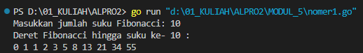
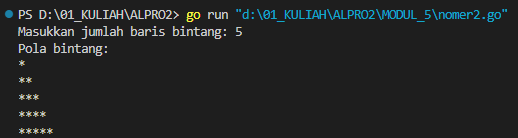
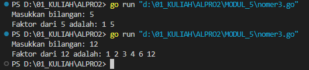
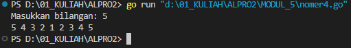
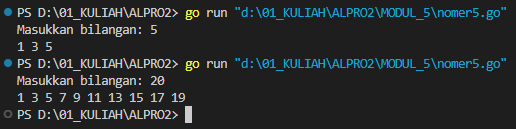
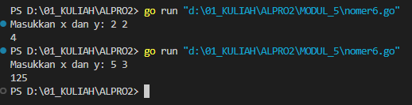

# <h1 align="center">Laporan Praktikum Modul 5 <br> REKURSIF </h1>
<p align="center">INAYAH NAJMI ZAKIA - 103112430013</p>

## Dasar Teori
Rekursif adalah teknik pemrograman yang memecah suatu masalah menjadi masalah yang lebih kecil yang serupa dengan masalah semula. Solusi masalah yang lebih kecil kemudian digunakan untuk menyelesaikan masalah semula. Rekursif dapat digunakan untuk menyelesaikan berbagai macam masalah, mulai dari masalah yang sederhana hingga masalah yang kompleks. Rekursif adalah suatu konsep dalam matematika dan ilmu komputer yang memungkinkan suatu fungsi atau prosedur untuk memanggil dirinya sendiri secara terusmenerus. Dalam rekursif, fungsi atau prosedur tersebut dapat memanggil dirinya sendiri dengan parameter yang berbeda-beda, sehingga dapat menyelesaikan masalah yang kompleks dengan cara yang lebih efektif.
# Unguided
___
# SOAL 2A
### No. 1
Deret fibonacci adalah sebuah deret dengan nilai suku ke-0 dan ke-1 adalah 0 dan 1, dan nilai suku ke-n selanjutnya adalah hasil penjumlahan dua suku sebelumnya. Secara umum dapat diformulasikan

𝑆𝑛 = 𝑆𝑛−1 + 𝑆𝑛−2 .

Berikut ini adalah contoh nilai deret fibonacci hingga suku ke-10. Buatlah program yang mengimplementasikan fungsi rekursif pada deret fibonacci tersebut.

```go
package main

import "fmt"

func fibonacci(n int) int {
    if n == 0 {
        return 0
    } else if n == 1 {
        return 1
    }
    return fibonacci(n-1) + fibonacci(n-2)
}

func main() {
    var n int
    fmt.Print("Masukkan jumlah suku Fibonacci: ")
    fmt.Scan(&n)
    fmt.Println("Deret Fibonacci hingga suku ke-", n, ":")
    for i := 0; i <= n; i++ {
        fmt.Print(fibonacci(i), " ")
    }
    fmt.Println()
}
```

> Output
> 

Kode di atas adalah program dalam bahasa Go yang digunakan untuk mencetak deret Fibonacci hingga suku ke-`n`. 
1. **Fungsi `fibonacci(n int) int`**
    - Merupakan fungsi rekursif yang menghitung nilai Fibonacci ke-`n`.
    - Basis kasus: Jika `n == 0`, mengembalikan `0`. Jika `n == 1`, mengembalikan `1`.
    - Untuk `n > 1`, nilai Fibonacci dihitung dengan menjumlahkan dua nilai sebelumnya, yaitu `fibonacci(n-1) + fibonacci(n-2)`.
2. **Fungsi `main()`**
    - Menerima input `n` dari pengguna untuk menentukan jumlah suku Fibonacci yang akan ditampilkan.
    - Menggunakan perulangan `for` dari `0` hingga `n` untuk mencetak setiap nilai Fibonacci dengan memanggil fungsi `fibonacci(i)`.

### No. 2
Buatlah sebuah program yang digunakan untuk menampilkan pola bintang berikut ini dengan menggunakan fungsi rekursif. N adalah masukan dari user.

```go
package main  

import "fmt"

func printRow(n int) {
    if n == 0 {
        return
    }
    fmt.Print("*")
    printRow(n - 1)
}

func printStars(n int) {
    if n == 0 {
        return
    }
    printStars(n - 1)
    printRow(n)      
    fmt.Println()    
}

func main() {
    var n int
    fmt.Print("Masukkan jumlah baris bintang: ")
    fmt.Scan(&n)
    fmt.Println("Pola bintang:")
    printStars(n)
}
```

> Output
> 

Kode di atas adalah program dalam bahasa Go yang digunakan untuk mencetak pola bintang berbentuk segitiga dengan rekursi.

**1. Fungsi `printRow(n int)`**
- Fungsi ini mencetak `n` bintang (`*`) secara rekursif dalam satu baris.
- Basis kasus: Jika `n == 0`, maka fungsi berhenti (`return`).
- Jika `n > 0`, maka mencetak satu bintang (`fmt.Print("*")`) dan memanggil dirinya sendiri dengan `n - 1`.

**2. Fungsi `printStars(n int)`**
- Fungsi ini mencetak `n` baris bintang dengan menggunakan rekursi.
- Basis kasus: Jika `n == 0`, maka fungsi berhenti (`return`).
- Rekursi dijalankan dengan **memanggil dirinya sendiri lebih dulu (`printStars(n - 1)`)**, sehingga pola akan dicetak dari atas ke bawah.
- Setelah pemanggilan rekursi, `printRow(n)` akan mencetak `n` bintang pada baris tersebut, kemudian berpindah ke baris baru (`fmt.Println()`).

### No. 3
Buatlah program yang mengimplementasikan rekursif untuk menampilkan faktor bilangan dari suatu N, atau bilangan yang apa saja yang habis membagi N. 

Masukan terdiri dari sebuah bilangan bulat positif N. 
Keluaran terdiri dari barisan bilangan yang menjadi faktor dari N (terurut dari 1 hingga N ya).

```go
package main  

import "fmt"  

func findFactors(n, i int) {
    if i > n {
        return
    }
    if n%i == 0 {
        fmt.Print(i, " ")
    }
    findFactors(n, i+1)
}

func main() {
    var n int
    fmt.Print("Masukkan bilangan: ")
    fmt.Scan(&n)
    fmt.Print("Faktor dari ", n, " adalah: ")
    findFactors(n, 1)
    fmt.Println()
}
```

> Output
> 

Program ini mencari dan mencetak semua faktor dari bilangan `n` menggunakan rekursi.
1. **Fungsi `findFactors(n, i int)`**
    - Basis kasus: Jika `i > n`, fungsi berhenti (`return`).
    - Jika `n % i == 0`, berarti `i` adalah faktor `n`, lalu dicetak.
    - Fungsi dipanggil kembali dengan `i+1` hingga mencapai `n`.
2. **Fungsi `main()`**
    - Mengambil input `n` dari pengguna.
    - Memanggil `findFactors(n, 1)` untuk mencari faktor `n` mulai dari `1`.

### No. 4
Buatlah program yang mengimplementasikan rekursif untuk menampilkan barisan bilangan tertentu. 

Masukan terdiri dari sebuah bilangan bulat positif N. 
Keluaran terdiri dari barisan bilangan dari N hingga 1 dan kembali ke N.

```go
package main  

import "fmt"

func printDescending(n, current int) {
    if current == 0 {
        return
    }
    fmt.Print(current, " ")
    printDescending(n, current-1)
}

func printAscending(n, current int) {
    if current > n {
        return
    }
    fmt.Print(current, " ")
    printAscending(n, current+1)
}

func main() {
    var n int
    fmt.Print("Masukkan bilangan: ")
    fmt.Scan(&n)
    printDescending(n, n)
    printAscending(n, 2)
    fmt.Println()
}
```

> Output
> 

Kode ini mencetak bilangan dari `n` ke `1`, lalu dari `2` ke `n`, menggunakan rekursi untuk membentuk pola simetris.
1. **`printDescending(n, current)`**
    - Mencetak `current`, lalu memanggil dirinya sendiri dengan `current-1` hingga mencapai `0`.
    - Output: Menampilkan angka dari `n` ke `1`.    
2. **`printAscending(n, current)`**
    - Mencetak `current`, lalu memanggil dirinya sendiri dengan `current+1` hingga mencapai `n`.
    - Dimulai dari `2` agar `1` tidak dicetak dua kali.
    - Output: Menampilkan angka dari `2` ke `n`.
### No. 5
Buatlah program yang mengimplementasikan rekursif untuk menampilkan barisan bilangan ganjil.

Masukan terdiri dari sebuah bilangan bulat positif N. 
Keluaran terdiri dari barisan bilangan ganjil dari 1 hingga N.

```go
package main

import "fmt"

func printOdd(n, current int) {
    if current > n {
        return
    }
    fmt.Print(current, " ")
    printOdd(n, current+2)
}

func main() {
    var n int
    fmt.Print("Masukkan bilangan: ")
    fmt.Scan(&n)
    printOdd(n, 1)
    fmt.Println()

}
```

> Output
> 

Kode ini mencetak bilangan ganjil dari `1` hingga `n` menggunakan rekursi.
1. **`printOdd(n, current)`**
    - Basis kasus: Jika `current > n`, fungsi berhenti (`return`).
    - Mencetak `current`, lalu memanggil dirinya sendiri dengan `current+2` untuk melompati bilangan genap.
    - Hanya mencetak bilangan ganjil karena `current` dimulai dari `1` dan selalu bertambah `2`.
2. **`main()`**
    - Mengambil input `n` dari pengguna.
    - Memanggil `printOdd(n, 1)`, yang mencetak bilangan ganjil dari `1` hingga `n`.

### No. 6
Buatlah program yang mengimplementasikan rekursif untuk mencari hasil pangkat dari dua buah bilangan.

Masukan terdiri dari bilangan bulat x dan y. 
Keluaran terdiri dari hasil x dipangkatkan y.

Catatan: diperbolehkan menggunakan asterik "*", tapi dilarang menggunakan import "math".

```go
package main

import "fmt"  

func power(x, y int) int {
    if y == 0 {
        return 1
    }
    return x * power(x, y-1)
}

func main() {
    var x, y int
    fmt.Print("Masukkan x dan y: ")
    fmt.Scan(&x, &y)
    result := power(x, y)
    fmt.Println(result)
}
```

> Output
> 

Kode ini menghitung **x^y (x pangkat y)** menggunakan rekursi.
1. **`power(x, y int) int`**
    - Basis kasus: Jika `y == 0`, maka hasilnya `1` karena **setiap bilangan yang dipangkatkan 0 bernilai 1**.
    - Rekursif: Mengembalikan `x * power(x, y-1)`, yaitu mengalikan `x` dengan hasil pemanggilan fungsi untuk `y-1`.
2. **`main()`**
    - Mengambil input dua bilangan `x` dan `y` dari pengguna.
    - Memanggil fungsi `power(x, y)` untuk menghitung `x^y`.
    - Mencetak hasil perhitungan.
