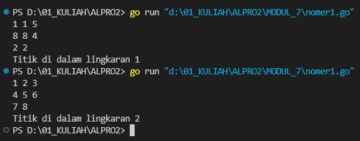
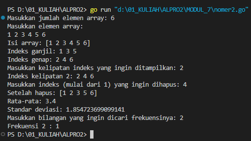
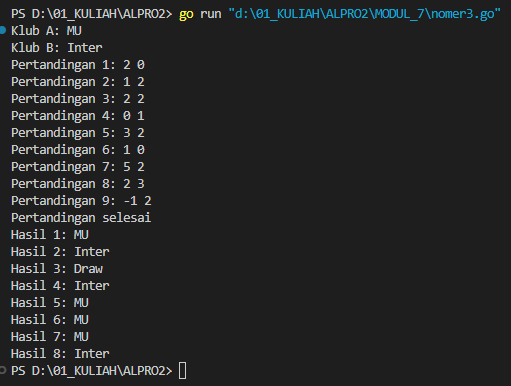
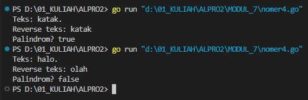

# <h1 align="center">Laporan Praktikum Modul 4 <br> STRUCT ARRAY</h1>
<p align="center">INAYAH NAJMI ZAKIA - 103112430013</p>

## Dasar Teori
Dalam bahasa Go, **struct array** adalah kombinasi antara struct dan array yang memungkinkan penyimpanan sekumpulan data dengan struktur yang sama. Struct digunakan untuk mengelompokkan berbagai jenis data dalam satu entitas, sedangkan array menyimpan banyak elemen dengan tipe yang sama dalam jumlah tetap. Dengan struct array, kita dapat membuat array yang berisi sekumpulan struct, misalnya array dari struct `Mahasiswa` yang menyimpan data nama, umur, dan nilai setiap mahasiswa. Hal ini memungkinkan pengelolaan data yang lebih terstruktur dan efisien, terutama dalam aplikasi yang membutuhkan penyimpanan dan manipulasi data dalam jumlah banyak, seperti sistem informasi akademik atau manajemen inventaris.

# Unguided
___
# SOAL LATIHAN MODUL 7
### No. 1
Suatu lingkaran didefinisikan dengan koordinat titik pusat (𝑐𝑥, 𝑐𝑦) dengan radius 𝑟. Apabila diberikan dua buah lingkaran, maka tentukan posisi sebuah titik sembarang (𝑥, 𝑦) berdasarkan dua lingkaran tersebut. Gunakan tipe bentukan titik untuk menyimpan koordinat, dan tipe bentukan lingkaran untuk menyimpan titik pusat lingkaran dan radiusnya. 

Masukan terdiri dari beberapa tiga baris. Baris pertama dan kedua adalah koordinat titik pusat dan radius dari lingkaran 1 dan lingkaran 2, sedangkan baris ketiga adalah koordinat titik sembarang. Asumsi sumbu x dan y dari semua titik dan juga radius direpresentasikan dengan bilangan bulat. 

Keluaran berupa string yang menyatakan posisi titik "Titik di dalam lingkaran 1 dan 2", "Titik di dalam lingkaran 1", "Titik di dalam lingkaran 2", atau "Titik di luar lingkaran 1 dan 2".

```go
package main
import (
    "fmt"
    "math"
)
type Titik struct {
    x, y int
}

type Lingkaran struct {
    pusat  Titik
    radius int
}

func jarak(p, q Titik) float64 {
    return math.Sqrt(float64((p.x-q.x)*(p.x-q.x) + (p.y-q.y)*(p.y-q.y)))
}

func didalam(c Lingkaran, p Titik) bool {
    return jarak(c.pusat, p) <= float64(c.radius)
}

func main() {
    var lingkaran [2]Lingkaran
    var p Titik
    for i := 0; i < 2; i++ {
        fmt.Scan(&lingkaran[i].pusat.x, &lingkaran[i].pusat.y, &lingkaran[i].radius)}
    fmt.Scan(&p.x, &p.y)
    inC1 := didalam(lingkaran[0], p)
    inC2 := didalam(lingkaran[1], p)
    if inC1 && inC2 {
        fmt.Println("Titik di dalam lingkaran 1 dan 2")
    } else if inC1 {
        fmt.Println("Titik di dalam lingkaran 1")
    } else if inC2 {
        fmt.Println("Titik di dalam lingkaran 2")
    } else {
        fmt.Println("Titik di luar lingkaran 1 dan 2")
    }
}
}```

> Output
> 

Program ini bertujuan untuk mengecek apakah suatu titik berada di dalam satu atau dua lingkaran berdasarkan koordinat yang diberikan.
1. **Struktur Data**
    - `Titik` adalah struct yang merepresentasikan koordinat `(x, y)`.
    - `Lingkaran` adalah struct yang terdiri dari `pusat` (Titik) dan `radius` (int).
2. **Fungsi-fungsi**
    - `jarak(p, q Titik) float64`  
        → Menghitung jarak antara dua titik menggunakan rumus **Euclidean Distance**:        
        d=(x2−x1)2+(y2−y1)2d = \sqrt{(x_2 - x_1)^2 + (y_2 - y_1)^2}
    - `didalam(c Lingkaran, p Titik) bool`  
        → Mengecek apakah titik `p` berada di dalam lingkaran `c` dengan membandingkan jarak pusat ke titik `p` dengan `radius` lingkaran.
3. **Proses di `main()`**
    - Program membaca input untuk dua lingkaran (koordinat pusat dan radius).
    - Program membaca input untuk satu titik.
    - Program mengevaluasi apakah titik berada di dalam salah satu atau kedua lingkaran menggunakan fungsi `didalam()`.
    - Program mencetak hasil sesuai kondisi titik terhadap lingkaran (di dalam satu, dua, atau di luar keduanya).

### No. 2
Sebuah array digunakan untuk menampung sekumpulan bilangan bulat. Buatlah program bahasa go yang digunakan untuk mengisi array tersebut sebanyak N elemen nilai. Asumsikan array memiliki kapasitas penyimpanan data sejumlah elemen tertentu. Program dapat menampilkan beberapa informasi berikut:
a. Menampilkan keseluruhan isi dari array. 
b. Menampilkan elemen-elemen array dengan indeks ganjil saja. 
c. Menampilkan elemen-elemen array dengan indeks genap saja (asumsi indek ke-0 adalah genap). 
d. Menampilkan elemen-elemen array dengan indeks kelipatan bilangan x. x bisa diperoleh dari masukan pengguna. 
e. Menghapus elemen array pada indeks tertentu, asumsi indeks yang hapus selalu valid. Tampilkan keseluruhan isi dari arraynya, pastikan data yang dihapus tidak tampil 
f. Menampilkan rata-rata dari bilangan yang ada di dalam array. 
g. Menampilkan standar deviasi atau simpangan baku dari bilangan yang ada di dalam array tersebut. h. Menampilkan frekuensi dari suatu bilangan tertentu di dalam array yang telah diisi tersebut.

```go
package main

import (
    "fmt"
    "math"
)

func mean(arr []int) float64 {
    sum := 0
    for _, v := range arr {
        sum += v
    }
    return float64(sum) / float64(len(arr))
}

func stdDev(arr []int) float64 {
    m, sum := mean(arr), 0.0
    for _, v := range arr {
        sum += math.Pow(float64(v)-m, 2)
    }
    return math.Sqrt(sum / float64(len(arr)))
}

func main() {
    var n, x, delIdx, freqNum int
    fmt.Print("Masukkan jumlah elemen array: ")
    fmt.Scan(&n)
    arr := make([]int, n)
    fmt.Println("Masukkan elemen array:")
    for i := range arr {
        fmt.Scan(&arr[i])
    }

    fmt.Println("Isi array:", arr)
    fmt.Print("Indeks ganjil:")
    for i := 0; i < n; i += 2 {
        fmt.Print(" ", arr[i])
    }

    fmt.Println()
    fmt.Print("Indeks genap:")
    for i := 1; i < n; i += 2 {
        fmt.Print(" ", arr[i])
    }
    
    fmt.Println()
    fmt.Print("Masukkan kelipatan indeks yang ingin ditampilkan: ")
    fmt.Scan(&x)
    fmt.Print("Indeks kelipatan ", x, ":")
    for i := x - 1; i < n; i += x {
        fmt.Print(" ", arr[i])
    }
    
    fmt.Println()
    fmt.Print("Masukkan indeks (mulai dari 1) yang ingin dihapus: ")
    fmt.Scan(&delIdx)
    delIdx--
    arr = append(arr[:delIdx], arr[delIdx+1:]...)
    fmt.Println("Setelah hapus:", arr)
    fmt.Println("Rata-rata:", mean(arr))
    fmt.Println("Standar deviasi:", stdDev(arr))
    fmt.Print("Masukkan bilangan yang ingin dicari frekuensinya: ")
    fmt.Scan(&freqNum)
    count := 0
    for _, v := range arr {
        if v == freqNum {
            count++
        }
    }
    fmt.Println("Frekuensi", freqNum, ":", count)
}```

> Output
> 

Program ini mengolah array integer dengan berbagai operasi, termasuk menampilkan elemen berdasarkan indeks tertentu, menghapus elemen, menghitung rata-rata dan standar deviasi, serta mencari frekuensi kemunculan suatu angka.
1. **`mean(arr []int) float64`**
    - Menghitung rata-rata dari elemen array.
    - Menjumlahkan semua elemen dan membaginya dengan jumlah elemen.
2. **`stdDev(arr []int) float64`**
    - Menghitung standar deviasi untuk melihat sebaran data dari rata-rata.
    - `mean(arr)` dipanggil untuk mendapatkan nilai rata-rata (`μ`).
3. **Input dan Pengisian Array**
    - Program meminta jumlah elemen (`n`) dan membaca `n` angka untuk disimpan dalam array.
4. **Menampilkan Elemen Berdasarkan Indeks**
    - **Indeks ganjil** (mulai dari indeks 0, ditampilkan setiap `i += 2`).
    - **Indeks genap** (mulai dari indeks 1, ditampilkan setiap `i += 2`).
    - **Indeks kelipatan tertentu** (user memasukkan angka `x`, lalu program menampilkan elemen pada indeks kelipatan `x`).
5. **Menghapus Elemen Berdasarkan Indeks**
    - User memasukkan indeks yang ingin dihapus
6. **Menghitung Statistik Array**
    - **Rata-rata** dari elemen array.
    - **Standar deviasi** untuk melihat variasi nilai dalam array.
7. **Mencari Frekuensi Kemunculan Suatu Angka**
    - User memasukkan angka tertentu.
    - Program menghitung berapa kali angka tersebut muncul di array.

### No. 3
Sebuah program bahasa go digunakan untuk menyimpan dan menampilkan nama-nama klub yang memenangkan pertandingan bola pada suatu grup pertandingan. 
Buatlah program yang digunakan untuk merekap skor pertandingan bola 2 buah klub bola yang berlaga. Pertama-tama program meminta masukan nama-nama klub yang bertanding, kemudian program meminta masukan skor hasil pertandingan kedua klub tersebut. Yang disimpan dalam array adalah nama-nama klub yang menang saja. 
Proses input skor berhenti ketika skor salah satu atau kedua klub tidak valid (negatif). Di akhir program, tampilkan daftar klub yang memenangkan pertandingan.

```go
package main

import (
    "fmt"
)

func main() {
    var klubA, klubB string
    fmt.Print("Klub A: ")
    fmt.Scanln(&klubA)
    fmt.Print("Klub B: ")
    fmt.Scanln(&klubB)
    var skorA, skorB int
    var pemenang []string
    pertandingan := 1
    for {
        fmt.Printf("Pertandingan %d: ", pertandingan)
        fmt.Scan(&skorA, &skorB)
        if skorA < 0 || skorB < 0 {
            break
        }

        if skorA > skorB {
            pemenang = append(pemenang, klubA)
        } else if skorB > skorA {
            pemenang = append(pemenang, klubB)
        } else {
            pemenang = append(pemenang, "Draw")
        }
        
        pertandingan++
    }
    fmt.Println("Pertandingan selesai")
    for i, p := range pemenang {
        fmt.Printf("Hasil %d: %s\n", i+1, p)
    }

}```

> Output
> 

Program ini bertujuan untuk mencatat hasil pertandingan antara dua klub sepak bola hingga pengguna memasukkan skor negatif, yang menandakan pertandingan berakhir.
1. **Input Nama Klub**
    - Program meminta input nama **klub A** dan **klub B** menggunakan `fmt.Scanln(&klubA)` dan `fmt.Scanln(&klubB)`.
2. **Looping untuk Input Skor Pertandingan**
    - `for` loop digunakan untuk menerima skor dari setiap pertandingan.
    - Setiap pertandingan diberi nomor (`pertandingan` mulai dari 1 dan bertambah setiap iterasi).
    - Pengguna memasukkan **dua angka** (skor A dan skor B).
    - Jika ada **skor negatif**, loop berhenti (`break`).
3. **Menentukan Pemenang Setiap Pertandingan**
    - Jika **skorA > skorB**, maka **klub A menang** dan namanya dimasukkan ke dalam slice `pemenang`.
    - Jika **skorB > skorA**, maka **klub B menang**.
    - Jika **skorA == skorB**, hasilnya adalah **"Draw"**.        
4. **Menampilkan Hasil Pertandingan**
    - Setelah loop selesai, program menampilkan **daftar hasil pertandingan**, termasuk siapa yang menang atau jika pertandingan berakhir seri.

### No. 4
Sebuah array digunakan untuk menampung sekumpulan karakter, Anda diminta untuk membuat sebuah subprogram untuk melakukan membalikkan urutan isi array dan memeriksa apakah membentuk palindrom.

```go
package main
import (
    "fmt"
)

const NMAX int = 127  
type tabel [NMAX]rune
func isiArray(t *tabel, n *int) {
    var ch rune
    *n = 0
    for {
        fmt.Scanf("%c", &ch)
        if ch == '.' || *n >= NMAX {
            break
        }
        t[*n] = ch
        *n++
    }
}
func cetakArray(t tabel, n int) {
    for i := 0; i < n; i++ {
        fmt.Printf("%c", t[i])
    }
    fmt.Println()
}
func balikanArray(t *tabel, n int) {
    for i, j := 0, n-1; i < j; i, j = i+1, j-1 {
        t[i], t[j] = t[j], t[i]
    }
}
func palindrom(t tabel, n int) bool {
    for i := 0; i < n/2; i++ {
        if t[i] != t[n-1-i] {
            return false
        }
    }
    return true
}
func main() {
    var tab tabel
    var m int
    fmt.Print("Teks: ")
    isiArray(&tab, &m)
    fmt.Print("Reverse teks: ")
    balikanArray(&tab, m)
    cetakArray(tab, m)
    fmt.Print("Palindrom? ")
    if palindrom(tab, m) {
        fmt.Println("true")
    } else {
        fmt.Println("false")
    }
}
}```

> Output
> 

Program ini menerima input berupa teks, membalik urutannya, mencetak hasilnya, dan memeriksa apakah teks tersebut adalah **palindrom** (teks yang sama jika dibaca dari depan maupun belakang).
1. **`isiArray(t *tabel, n *int)`**
    - Mengisi array `t` dengan karakter yang dimasukkan oleh pengguna.
    - Pengguna bisa mengetik teks apa pun, dan input berhenti jika karakter `.` dimasukkan atau jumlah karakter mencapai batas `NMAX`.
2. **`cetakArray(t tabel, n int)`**
    - Mencetak isi array `t` sepanjang `n` karakter tanpa spasi tambahan.
3. **`balikanArray(t *tabel, n int)`**
    - Membalik urutan karakter dalam array menggunakan teknik **two-pointer swapping**.
4. **`palindrom(t tabel, n int)`**
    - Mengecek apakah teks yang sudah dimasukkan adalah **palindrom**.
    - Loop membandingkan karakter dari depan dan belakang (`t[i]` dengan `t[n-1-i]`), jika ada yang tidak cocok, return `false`.
5. **`main()`**
    - Memanggil fungsi `isiArray()` untuk menerima input teks.
    - Membalik teks dengan `balikanArray()`, lalu mencetaknya.
    - Memeriksa apakah teks termasuk **palindrom** dengan `palindrom()`.